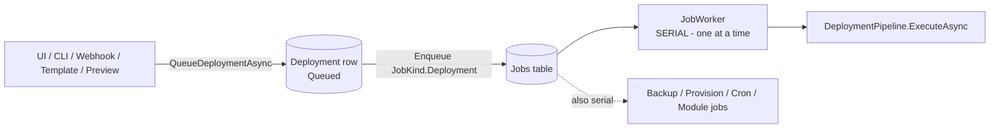
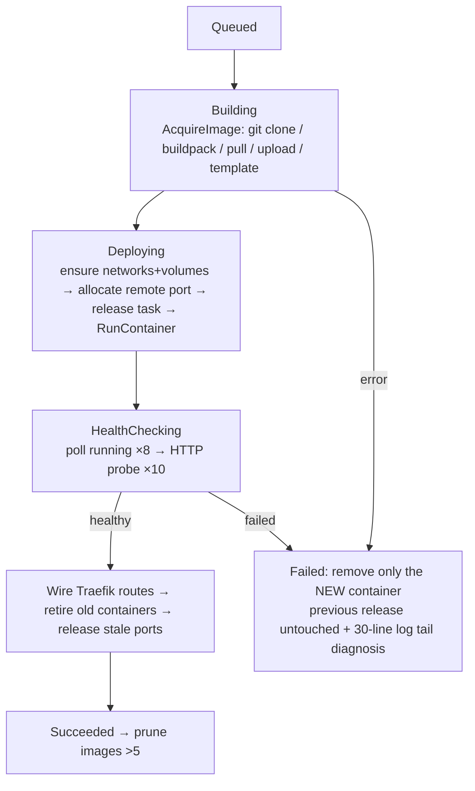
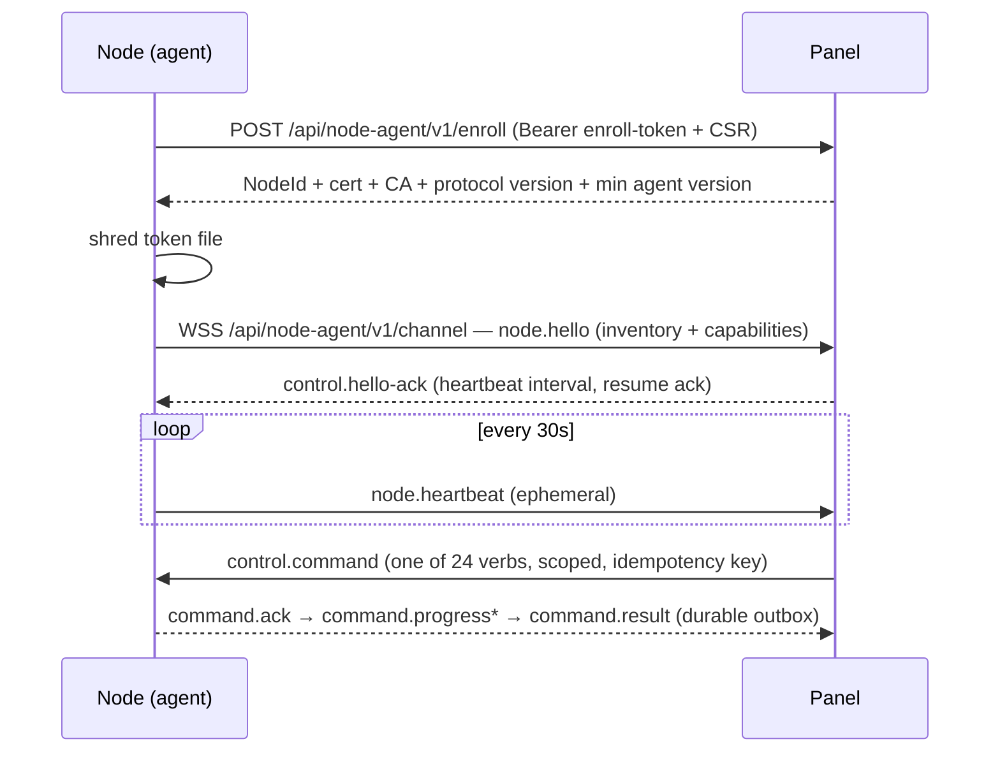

# 01 — Current System Map

**Audit date:** 2026-08-07 · **Commit:** `8b1f6e9` (master) · **Product version:** 0.2.0 (`Directory.Build.props:11`)
**Method:** extracted from code; every claim carries a file reference. Security analysis is explicitly out of scope for this audit.

---

## 1. Solution layout (16 projects + 3 test projects)

| Project | Responsibility | Depends on |
|---|---|---|
| `Harbora.Domain` | 55 entity classes, enums, state machines (`DeploymentStateMachine`), authorization matrix. No I/O. | — |
| `Harbora.Application` | 23 abstraction files (ports): `IDockerEngine`, `IJobQueue`, `IBackupEngine`, `INotificationService`, `IWorkspaceScope`… No implementations. | Domain |
| `Harbora.Data` | `HarboraDbContext` (63 tables), 46 Npgsql migrations, `DbSeeder`. PostgreSQL only — zero SQLite support. | Domain, Application |
| `Harbora.Infrastructure` | ~230 files / 29k LOC. Deployment pipeline, job queue, Docker engines, Traefik proxy, managed services, backups (legacy), monitoring, notifications, nodes control plane, AI gateway, storage, tenancy. | Domain, Application, Data |
| `Harbora.Web` | ASP.NET control plane: 34 UI controllers + 5 API controllers, 84 Razor views, 4 Vue islands, SignalR hub, localization (fa default / en), PWA. | Infrastructure |
| `Harbora.Cli` | `harbora` deploy CLI: 10 files / ~830 LOC, Spectre.Console. 8 commands. | (standalone; talks to `/api/v1`) |
| `Harbora.Agent` | **Legacy** inbound HTTP agent (port 9700, bearer token). Minimal API over Docker. Not deprecated, no tests. | Application, Infrastructure, Shared |
| `Harbora.NodeAgent` | Node Agent v1: outbound-only systemd agent, mTLS, 24-verb dispatcher, durable outbox/ledger, self-update with rollback, ingress tunnel. | NodeAgent.Contracts |
| `Harbora.NodeAgent.Contracts` | Versioned protocol v1: frames, verbs, specs. Mirrored by `contracts/node-agent/v1/node-agent.v1.schema.json` (draft 2020-12) and enforced by conformance tests. | — |
| `Harbora.Shared` | `PathGuard` (shared so Backup and Sync modules stay decoupled). | — |
| `Modules/Backup` (3 projects) | **Second** backup system (repository/policy/snapshot/restore, Native + Kopia engines). Behind `Features:Backup` (default **off**). | Shared, Application |
| `Modules/Sync` (3 projects) | Syncthing-driven file sync module. Behind `Features:Sync` (default **off**). Never run against a real daemon. | Shared |
| `tests/Harbora.Tests` | 183 files, ~2,066 facts. EF InMemory only — no Postgres, no Testcontainers, no `WebApplicationFactory`. | all |
| `tests/Harbora.NodeAgent.Tests` | 17 files, ~285 facts + 19 `[DockerFact]` real-daemon tests. Deliberately EF/ASP.NET-free. | NodeAgent |
| `tests/Harbora.NodeIngress.Tests` | End-to-end ingress tunnel over real sockets/mTLS (15 facts). Only project referencing both codebases. | NodeAgent + Infrastructure |

**Local build/test result (2026-08-07, Windows, .NET 10.0.302, no Docker):**
- `dotnet build Harbora.slnx` → **0 errors, 0 warnings** (31 s).
- `dotnet test` → **Harbora.Tests 2684/2684 pass · NodeAgent.Tests 442 pass / 17 skipped (Docker unavailable — `DockerFactAttribute`) · NodeIngress.Tests 15/15 pass.** Zero failures.

---

## 2. Control plane runtime shape

`src/Harbora.Web/Program.cs` (241 lines):

- Break-glass `harbora admin …` verb short-circuits before DI (`Program.cs:34`), so recovery works while the panel can't boot.
- Startup order: **pre-migration DB restore point** (`UpgradeSafetyService.EnsureRestorePointAsync` — refuses to migrate if the dump fails) → `MigrateAsync` → `DbSeeder.SeedAsync`; failures exit(1) instead of hanging (`Program.cs:161-183`).
- Auth: cookie (7-day sliding) + bearer `TokenAuthenticationHandler` for API/CLI; capability policies; CSRF header `X-CSRF-TOKEN`.
- Localization: `fa` default, `en` second; culture cookie first.
- Rate limiting: `auth` 10/IP/min, `webhook` 60/IP/min.
- SignalR: one hub `/hubs/deployments`; separate raw WebSocket for the node channel (`/api/node-agent/v1/channel`).

**22 background/hosted services** (`Infrastructure/DependencyInjection.cs`, modules):
`JobReconciler`, `JobWorker`, `DeploymentReconciler`, `CronRunner`, `MetricsCollectorHostedService` (30 s), `MetricsRollupService`, `CertificateWatcher` (24 h), `NodeHeartbeatMonitor` (30 s), `NodeTunnelGateway`, `NodeIngressRebinder`, `BackupScheduler`, `BackupVerifier` (hourly), `PreviewSweeper`, `RegistryDiscoveryService`, `DatabaseAccessSweeper`, `BucketMeasurementSweeper`, `UpdateCheckService`, `AdminerSweeper`, `MeteringService` (15 min), `StorageMeasurer`, `BackupPolicyScheduler` (module), `SyncStatusRefresher` (module).

---

## 3. Job/queue architecture — the platform's spine (and its main constraint)

- **Postgres-backed durable queue.** `Job` row + `JobSignal` + 5 s poll backstop (`Jobs/DatabaseJobQueue.cs`). Claim via `ClaimStamp` optimistic concurrency (migration `20260728133857_DurableJobQueue`). Redis is **not used anywhere** — `StackExchange.Redis` is a dead package reference (`Harbora.Infrastructure.csproj:20`); README's "Jobs: background worker + Redis" is wrong.
- `JobKind`: `Deployment, Backup, ServiceProvision, CronRun` (built-in) + `BackupSnapshot, BackupRestore, BackupVerify, BackupPrune, RepositoryHealthCheck` (module handlers).
- **One `JobWorker`, strictly serial** — claims and fully awaits exactly one job (`JobWorker.cs:40-100`; single registration `DependencyInjection.cs:100`). A 20-minute build blocks every backup, provision, cron and every other tenant's deploy. The multi-worker claim machinery exists but nothing runs a second worker.
- **No retry** (`Job.Attempts` incremented, never read; no-retry decision documented `JobReconciler.cs:47-49`). **No job-level timeout** (only per-operation bounds: release task 30 min, cron 1 h, remote agent HTTP 30 min). **Cancellation** is process-local (`JobCancellationRegistry`); cross-instance cancellation is claimed in comments but no checkpoint polling exists.
- **Restart recovery:** `JobReconciler` fails every `Running` job ("Interrupted by a platform restart"); `DeploymentReconciler` re-enqueues `Queued` deployments and fails in-flight ones. Known hole: a job returned to `Pending` by graceful shutdown races `DeploymentReconciler` at next boot → illegal-transition exception and a double-failed deployment (see 03, HARBORA-P0 items).

---

## 4. Deployment flow (Build → Deploy → Health → Cutover)

All 14 call sites funnel into `DeploymentEngine.QueueDeploymentAsync` (`Deployments/DeploymentEngine.cs:19`) — coalesces same-intent in-flight deploys, refuses rollback-vs-forward conflicts, writes an immutable `Deployment` row, enqueues the job.

`DeploymentPipeline.ExecuteAsync` (`Deployments/DeploymentPipeline.cs`, 1,123 lines — the single largest class):

- **Sources:** `GitRepository, Dockerfile, DockerCompose, PrebuiltImage, StaticSite, Template, Upload` (`Enums.cs:43-55`). Buildpacks auto-detect Node/.NET/Go/PHP/Python/static (`Buildpacks.cs:11`). Compose is a hand-written allowlist parser refusing privileged/host-mount constructs (`ComposeFile.cs:74-86,221-224`).
- **States (exact):** `Queued=0, Building=1, Pushing=2, Deploying=3, Succeeded=4, Failed=5, Cancelled=6, RolledBack=7, HealthChecking=8`. All writes go through `DeploymentStateMachine.Transition` which throws on illegal moves. **`Pushing` is dead** — never assigned by any production code.
- **Zero-downtime:** versioned container names `harbora-{slug}-{n}`; new starts beside old; old retired only after proxy cutover; on remote nodes old+new coexist on distinct published host ports (20000–29999, DB-unique `(ServerId, Port)`).
- **Rollback:** artifact-only re-release of a prior image; pre-flighted twice (`RollbackPlanner` checks the image still exists on the node); reach limited by `ImageRetentionCount = 5`.
- **Health:** container-running poll then HTTP probe of the same upstream Traefik will use; acceptance `<400` (or `<500` for unconfigured root path) — `HealthProbeRule.cs:23`. Failure taxonomy: `Vanished/Exited/CrashLooping/NeverStarted/NoHealthyResponse`.
- **Known false-success:** a failed Traefik apply writes one `⚠` log line and the deployment still goes `Succeeded` (`DeploymentPipeline.cs:1112-1115`) — see 03.

## 5. Restart / other app operations

`AppOperationsService` — start/stop/restart/delete (with `removeVolumes` option), log snapshot. Restart is a direct Docker call, not a deployment. After panel restart, `DeploymentReconciler` + `MetricsCollector.ReconcileAppStatusesAsync` converge app statuses (`Running↔Crashed`).

## 6. Node system

**Node Agent v1** (recommended): outbound-only; enrollment token (single-use, shredded on disk after use) → CSR → panel-owned CA issues cert → persistent WSS channel with resume tokens, durable on-disk outbox (500 frames), sequence-numbered frames, per-command nonce + freshness (5 min) + idempotency ledger (48 h) surviving restarts.

- **24 verbs** (schema-enforced closed enum; conformance test asserts no shell/exec verb exists): Deploy/Update/Stop/Start/Restart/Delete/Status/Stats/List workloads, StreamLogs, Create/Delete network, Create/Snapshot/Restore volume, Create/Revoke/Rotate DB access grant, Register HTTP/TCP route, RemoveRoute, ConfigureIngress, DrainNode, UpdateAgent.
- **Capability gaps by design:** a v1 node cannot build from Git, run one-off containers, release tasks, volume backups (panel-side engine), or terminals (`NodeWorkloadEngine.cs:123,389,400` throw `NodeCapabilityException`).
- **Self-update:** SHA-256-verified download, drain-first, marker-before-swap, post-restart version adjudication with automatic rollback to `.previous` binary.
- **Ingress tunnel (NAT nodes):** one tunnel per node; `Open` frame carries only a 4-byte port; resolver dials `127.0.0.1` and only ports the node itself published; panel binds per-port internal listeners that Traefik targets; ports persisted (`HostPortAllocation.IngressPort`) and rebound on panel restart (`NodeIngressRebinder`). Tested end-to-end over real sockets/mTLS (15 facts).
- **Legacy `Harbora.Agent`:** inbound HTTP :9700, token auth, effectively the Docker API. Still shipped, still documented in RUNBOOK, no deprecation marker, no tests.

**Engine seam:** `IDockerEngine` (20 methods) ← `DockerEngine` (local) / `NodeWorkloadEngine` (v1 verbs) / `RemoteDockerEngine` (legacy HTTP). Selection: `ServerEngineFactory` local → v1 node → legacy endpoint → throw (never silently falls back). **Violated by** `BackupEngine`, `DiskCleanupService`, `DockerTcpGateway`, which inject the local `IDockerEngine` directly — see 03.

## 7. Domain / SSL flow

- Domain rows unique on `Host`; default `{slug}.{RootDomain}` assigned per service kind.
- Routes are per-domain `Route` rows → `TraefikProxyEngine.Render` (StringBuilder-YAML) → validate → tmp+bak file swap into the Traefik-watched dynamic dir; Traefik hot-reloads. Rollback restores `.bak`; **no verification that Traefik accepted the file** (promised in `IProxyEngine` doc comment, absent in code).
  - **Corrected 2026-08-08:** at audit time the route list was a *caller-supplied* argument, and one file being rendered from one caller's subset was the P0 named in doc 00's correction block. The engine now reads every route itself through `IRouteCatalog`, serialises applies behind a gate, and leaves an invalid route out of the render rather than refusing the whole file — so one tenant's broken row fails only that tenant. A subset is no longer expressible.
- **SSL is 100 % Traefik ACME (HTTP-01, per-domain certs, `certresolver: letsencrypt`).** The panel never issues/renews; `CertificateWatcher` (daily) records observed state via a real TLS handshake (`DomainInspector`), recognizing Traefik's self-signed default as "no cert yet", and raises `SslExpiring` inside a 14-day window.
- UI has live per-domain DNS + TLS test buttons (`/domains/test-dns|test-ssl`).

## 8. Managed databases / networking / volumes

- 7 engines (`PostgreSql, MySql, MariaDb, Redis, MongoDb, RabbitMq, Nats`) with curated versions (`ServiceCatalog.cs:41`, operator-overridable). Provision = serial job → network+volume → pull → run (with optional Postgres TLS bootstrap that *falls back to unencrypted with a logged error*). Failure sets `Status=Failed` **silently** (no alert).
- Attach = engine-specific env injection (`DATABASE_URL`, `PG*`, prefixed `HARBORA_DB_*` for multiple DBs); rotation rewrites env vars on every app in the workspace but does **not** redeploy them.
- Per-environment Docker networks `harbora-env-{project}-{env}-{id}` + workspace network `harbora-ws-{slug}` (dual-attach transition still in effect). Architecture map UI is derived from real env vars.
- External DB access: TTL-bounded grants + per-grant TCP proxy container publishing a host port; sweeper expires them. **Broken edge:** `DatabaseAccessService.RotateAsync` always calls `INodeAgentClient`, whose only registered implementation is `FakeNodeAgentClient` (`DependencyInjection.cs:210`) → rotation always answers "No such login to rotate" on single-server installs.
- Volumes: rows on App; Docker volume created lazily at deploy; measured by `du` one-offs; **no deletion protection flag, no orphan enumeration, and on v1 nodes `RemoveVolumeAsync` is a no-op** (data intentionally left).
- Object storage: MinIO service in compose + `StorageBucket`/`StoragePlan`, per-bucket credential, object browser, quota measurement sweeper.

## 9. Backup / restore flows (two parallel systems)

| | Legacy (always on) | Module (`Features:Backup`, default off) |
|---|---|---|
| Model | `BackupDestination/Schedule/Backup/BackupDelivery` | `BackupRepository/Policy/Snapshot/RestoreJob` (+ owned `RetentionPolicy`) |
| Targets | Database, Volume, AppConfig, FullPlatform, Service | Directory, DockerVolume, Database, Application (4 of 8 enum values) |
| Destinations | Local, S3, SFTP (+ Telegram/email artifact **delivery**) | Local, S3-compatible family (native engine); Kopia local-only; SFTP/WebDav/HarboraNode/Custom **throw** |
| Verification | Hourly `BackupVerifier` with real restore rehearsal into scratch DB + checksum | `BackupVerify` job handler exists but **is never enqueued** → all snapshots permanently `NotVerified` |
| Restore safety | Pre-restore snapshot; checksum-gated | Typed confirmations; **`SafetySnapshotRef` never assigned** — no pre-restore copy |
| Restart recovery | (jobs failed by reconciler) | **None for snapshot/restore rows** → a crash mid-backup permanently blocks that target (see 03) |

Upgrade safety (platform itself): pre-migration `pg_dump` as one-off container, refuses to migrate on failure or zero-byte artifact, keeps newest 5, restorable via `harbora restore-db` (which itself takes a pre-restore dump and refuses if that fails).

## 10. Logs / metrics flow

- Deploy logs: engine thread → `ConcurrentQueue` → pipeline thread → `ISecretRedactor` → `LogText.Clean` (strips NUL for Postgres) → `DeploymentLog` rows + SignalR `deployment:{id}` group; Vue island backfills then subscribes, 1.5 s polling fallback.
- Runtime logs: on-demand container tail with substring search, "problems only" word-start matching, filtered download. No historical store beyond Docker's own.
- Metrics: panel-driven 30 s poll per server (`MetricsCollector`) → raw rows (24 h) → hour (31 d) / day (365 d) rollups; charts via `MetricsChart.vue` (15 s poll, "not measured yet" honesty). Node-reported stats come over `GetWorkloadStats`; null (not zero) for old agents. **Not collected:** uptime, restart count, response time, error rate (explicitly noted in the Monitoring view).

## 11. CLI flow

`login` (token or email+password → server-minted CLI token) → `deploy` (mode decided by `DeployPlan.Decide` precedence: `--image` > `--tar` > `--branch` > `--ref` > `--push` > yml image/branch > server-can-pull > `.git` presence) → pack (`.dockerignore` **or else** `.gitignore` + built-ins, never merged, no `!` negation) → raw-gzip POST (512 MB cap) → server extracts (2 GB / 200k entries, zip-slip guarded) → same pipeline as Git deploys → poll logs 1.5 s. Full endpoint list: 8 endpoints under `/api/v1` (see 02 §13).

## 12. Template deployment flow

`AppTemplate` + digest-pinned `AppTemplateVersion` (Lifecycle: Recommended→Unsupported; Publication: Draft/Published) + `AppTemplateAsset` logos → deploy form (version select, size, required variables) → `TemplateDeploymentService` provisions services + volumes + reference variables. Registry discovery job (off by default) writes Drafts only, allowlisted registries. **Gap:** `ParseServiceType` rejects `rabbitmq`/`nats` so templates cannot require brokers (`TemplateDeploymentService.cs:315`).

---

## 13. Cross-cutting findings

**High-coupling:**
- `DeploymentPipeline` — 1,123 lines, 14 constructor deps, mixes DB/Docker/compose/health/proxy/retention/state.
- `DependencyInjection.cs` — 241-line God registration.
- `IDockerEngine` vs `IServerEngineFactory` seam violated by 3 services (multi-node correctness bugs — see 03).

**Duplication:**
- Two backup systems, two notification-ish channel systems (`Alert` vs `BackupDelivery`), three plan tables (`Plan`, `StoragePlan`, `AiPlan`).
- `ResolveEnvironmentNetworkAsync` ×2; `SafeUnprotect` ×4 (one behaviorally different); `FindContainerIdAsync` ×2 with different label filters.
- Two nav label tables (`_Sidebar` vs `_Topbar`) that disagree; islands carry their own i18n dictionaries.

**Half-finished (declared or discovered):**
- `App.EnvironmentId` / `ManagedService.EnvironmentId` still nullable "during the transition" across 46 migrations.
- Preview environments: pieces exist, lifecycle doesn't. Dead: `DeploymentStatus.Pushing`, `AlertEvent.ThresholdBreached`, `CertificateStatus.Revoked`, module backup dead fields (hooks, compression, `AlertAfterHoursWithoutSuccess`, `MaximumRepositorySizeBytes`…), 7 node event kinds never published, heartbeat `ActiveDatabaseGrants/ActiveTunnels` never populated, CLI `context:`/`dockerfile:` parsed but unused, `examples/harbora.yml` advertises unsupported `env:`/`domains:` keys.
- Node-agent activation chain incomplete out of the box: `install.sh` never writes `NodeAgent__PublicUrl`; `deploy/traefik/dynamic/node-agent.yml` hardcodes `panel.example.com` and references a `node-ca` admin verb that does not exist.

**Untested areas** (details in 15): `NodeAgentWorker` loop, heartbeat contents, `TraefikProxyEngine.ApplyAsync` rollback, JobWorker shutdown race, all Web controllers via HTTP (no `WebApplicationFactory`), `SetupController`, `WebhooksController`, `MonitoringController`, `TerminalController`, SignalR hub, `deploy/install.sh`, `deploy/harbora`, legacy `Harbora.Agent` (entire project).

**UI without backend / backend without UI:** consolidated in 12 §7 — highlights: topbar bell → `/alerts` has no GET route (404); Networks page links `/databases/details/{id}` (404); Terminal breadcrumb `/apps/{guid}` (404); Backups SFTP destination form unreachable (fields rendered inside the wrong loop, toggle script throws); `POST /backups/{id}/verify` has no button; `deleteData` and `availableAtBuild` accepted by controllers but absent from forms; ~35 node/backup/sync API endpoints with no CLI consumer; `/v1` AI gateway surface documented nowhere in the UI.
