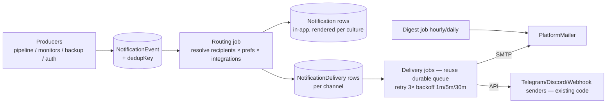

# 09 — Notification System Plan (Harbora's own events)

## 1. What exists today (evidence)
- One entity `Alert` = channel-config + event toggles + optional per-app threshold (`Domain/Monitoring/Alert.cs`). Workspace-scoped; **no per-user preferences, no history table, no delivery log, no templates, no in-app center** (bell → 404, R-17).
- Channels implemented: Email (SmtpClient / `PlatformMailer`), Telegram, Discord, Webhook (`Notifications/NotificationService.cs`) — one attempt, 10 s timeout, `LastAttemptAt/LastError` only.
- Events actually raised: `DeployFailed, AppCrashed, SslExpiring, DiskWarning, BackupFailed, Test` (+ threshold rule path bypassing the matcher; `ThresholdBreached` enum dead).
- Parallel channel system for backup artifacts (`BackupDelivery`); module defines 11 notification kinds, collapses to 1.
- All bodies inline strings; plain text; background-raised messages English-only (no request culture).
- Transactional user emails exist separately: password reset, invite, SMTP test (bilingual by current UI culture).

**Verdict:** what exists is alerting plumbing, not a notification system. The plan below evolves it without discarding the working channel senders.

## 2. Design principles
1. Event producers never talk to channels — they emit a `NotificationEvent`; routing/preference/delivery is the system's job.
2. Delivery is queued, retried, deduplicated, and logged — reuse the **existing durable job queue** (new `JobKind.NotificationDelivery`), no new infrastructure. (Requires 06 §1.1 parallelism so notifications never wait behind builds.)
3. In-app is a first-class channel and the default sink for everything; email is opt-out for critical, opt-in for the rest; Telegram/Discord/Webhook remain workspace-level integrations.
4. Bilingual from day one: fa + en templates, HTML + plain text; recipient's stored `PreferredCulture` decides (not request culture — fixes English-only background sends).
5. Don't page people twice: event dedup keys + digest coalescing + quiet hours.

## 3. Event catalog

Columns: **Recipients** (rule) · **Urgency** I=immediate, D=digestable · **Class** C=critical (not fully mutable; can only be re-routed), O=optional · **Default channels** (A=in-app, E=email, T/W=telegram/webhook suitable).

| Event | Recipients | Urg | Class | Default | Notes |
|---|---|---|---|---|---|
| EmailVerification* | the user | I | C | E | transactional rail, bypasses prefs (future — no signup flow yet) |
| Welcome / invite accepted | the user / inviter | I | O | E+A | invite email exists — fold into templates |
| PasswordReset | the user | I | C | E | transactional rail; exists |
| WorkspaceInvite | invitee | I | C | E | exists as invite; add A for existing users |
| RoleChanged | affected user | I | O | A (+E opt) | new |
| DeploySucceeded | deploy actor | D | O | A | opt-in E; noisy — never default email |
| DeployFailed | actor + ws Admins | I | C | A+E (+T/W) | exists as alert |
| BuildFailed | actor | I | C | A+E | today folded into DeployFailed — keep single event with stage field |
| RollbackPerformed | ws Admins | I | O | A+E | new (currently silent) |
| NodeOffline / NodeRecovered | platform Owner/Admins (+Operator) | I | C | A+E+T/W | new producer: `NodeHeartbeatMonitor` transition |
| DiskLow | Owner/Admins of the server | I | C | A+E+T/W | exists; keep 1-h repeat + add resolved |
| AppDown (crash) | app workspace Admins+actor | I | C | A+E+T/W | exists |
| HealthCheckFailing (sustained) | same | I | C | A+E | fold into AppDown severity levels |
| SslExpiring | ws Admins | D(daily) | C | A+E | exists; dedup per (host, day) |
| DomainProblem (DNS broken after having worked) | ws Admins | I | O | A+E | new producer: `CertificateWatcher`/`DomainInspector` diffs |
| BackupSucceeded | opt-in | D | O | A | daily digest line, never immediate email |
| BackupFailed | ws Admins + Owner | I | C | A+E+T/W | exists |
| NoRecentBackup | ws Admins | I | C | A+E | field exists, evaluator missing (08 §A2) |
| RestoreCompleted / RestoreFailed | restore actor + ws Admins | I | C | A+E | module kinds exist, unrouted |
| ResourceUsageHigh (threshold) | rule-configured | I | O | rule channel | exists; route through the same pipeline |
| QuotaLimitReached | ws Admins + provider | I | C | A+E | new producer: `QuotaService` refusals (once per day per limit) |
| TokenCreated/Revoked | the user + Owner | D | O | A | new; audit exists, notify optional |
| PeriodicReport (weekly summary) | opt-in per user | D | O | E | Phase-2 nicety; built on digest engine |
| MaintenanceAnnouncement | all users of affected scope | I | C | A+E | authored by provider (admin panel, P2) |
| IncidentOpened/Resolved | ws Admins | I | C | A+E+T/W | pairs with 08 §B2.4 alert lifecycle |
| AgentUpdated / AgentUpdateRolledBack | platform Admins | D / I | O / C | A (+E on rollback) | events exist agent-side already |

Role defaults: platform-scope events (nodes, disk, maintenance) → Owner/Admin/Operator only; workspace events → workspace Admins + acting user; Developers get their own actions' outcomes; Viewers get nothing by default. Every O-class event mutable per user; C-class events can change channel but at minimum remain in-app.

## 4. Architecture

### 4.1 Entities (details in 14)
- `NotificationEvent` — id, type, severity, workspace?/app?/node? refs, actor, payload JSON, dedup key, created. Producers write this + enqueue routing job. Retention 90 d.
- `Notification` (in-app item) — per recipient: event ref, title/body (rendered at write time in recipient culture), link, read-at. Index (UserId, ReadAt, CreatedAt).
- `NotificationPreference` — per user × event-type (× workspace for ws events): channels mask, digest? , muted?. Absent row = defaults above.
- `NotificationChannelIntegration` — evolves today's `Alert` rows: workspace-level Telegram/Discord/Webhook/extra-email targets (encrypted target stays), + `MinSeverity`. The per-app threshold half of `Alert` moves to `AlertRule` (see 08 §B2.4).
- `NotificationDelivery` — one row per (event × channel × recipient): status Pending/Sent/Failed/Suppressed(dedup/quiet/digested), attempts, last error, provider message id. This is the delivery log the UI shows.
- `QuietHours` on preference (start/end + tz) — deliveries in window downgrade to digest (except C-class).

### 4.2 Flow

- **Dedup:** unique index on `(DedupKey)` within a sliding window (e.g. `ssl:{host}:{yyyy-mm-dd}`, `disk:{server}:{hour}`) — replaces the in-memory `AlertThrottle` (fixes restart double-fire, multi-instance ready).
- **Retry:** delivery job `MaxAttempts=3`, exponential; terminal failure keeps the row `Failed` with reason (visible in UI) — fixes R-13.
- **Digest:** hourly job groups D-class pending deliveries per user into one email (fa/en template with sections); daily weekly-report variant later.
- **Templates:** Razor-rendered partials (the app already renders Razor + has `SharedResource` infra): `Templates/Notifications/{EventType}.{culture}.cshtml` producing HTML + text alternative. No new engine.
- **Test:** per-integration "send test" exists — keep; add per-event preview in admin.
- **In-app UI:** bell → dropdown (last 10 + unread count via existing SignalR hub pattern or 30 s poll) + `/notifications` page (filter, mark read, bulk read). Reuses the pagination/filter idioms from Audit page.
- **Tenant branding:** future — template override per workspace (logo/name vars already available); design keeps template lookup indirection so branding is a data change.

### 4.3 Migration path
1. Keep `NotificationService` senders as the channel executors (they're fine; add retry wrapper).
2. `Alert` rows auto-migrate: channel config → `NotificationChannelIntegration`; threshold half → `AlertRule`. Event toggles → workspace-default preferences.
3. Producers switch call-by-call from `NotifyAsync` to `PublishEvent` (small PRs; both live during transition).
4. Remove `AlertThrottle` after dedup keys land.

## 5. Phasing
- **Phase 9a (with Notification phase, M+):** entities + routing + in-app center + email channel + dedup + retry + fa/en HTML templates for the C-class events that already have producers (DeployFailed, AppCrashed, SslExpiring, DiskWarning, BackupFailed, Restore*, NodeOffline, QuotaLimitReached, NoRecentBackup).
- **Phase 9b (S/M):** preferences UI, digest, quiet hours, DeploySucceeded/Rollback/Role/Token events, weekly report.
- **Phase 13 (admin):** MaintenanceAnnouncement authoring, delivery overview dashboards.
- Explicit non-dependency: works with **BYO SMTP only** (platform SMTP settings exist); does not wait for the customer email service (10).

## 6. Acceptance criteria
- Killing the panel between event and delivery loses nothing (durable rows; jobs resume).
- A failed Discord webhook retries 3×, then shows `Failed: <reason>` in the delivery log; the in-app copy still exists.
- Persian-preference user receives Persian email for a background-raised event (fixes English-only gap).
- SSL-expiring for one host emails once per day maximum regardless of watcher runs or restarts.
- Bell shows a real unread count; `/notifications` lists, filters, bulk-marks read.
- Removing SMTP config degrades email deliveries to `Suppressed(no-smtp)` — never exceptions, in-app unaffected.

## 7. Required tests (roll into 15)
Routing matrix (event × role × pref), dedup-window property test, retry/backoff with fake clock, digest grouping, culture selection, quiet-hours boundary, migration of legacy `Alert` rows, in-app pagination, and a producer-coverage test asserting every enum event type has ≥1 template pair (fa+en).
