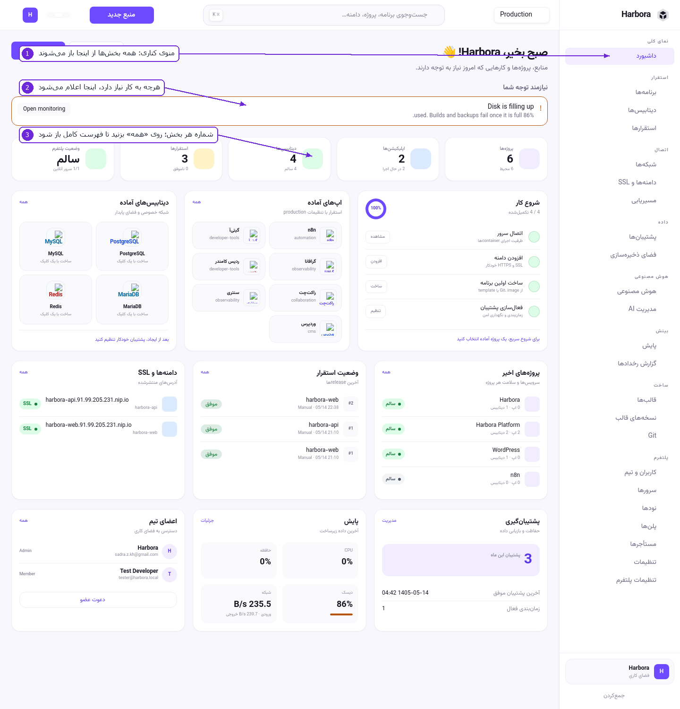

# ۱ — اولین قدم‌ها

## ورود

آدرس پنل همان دامنه‌ای است که موقع نصب داده‌اید (مثلاً `https://panel.example.com`). با ایمیل و
رمزی که در نصب ساخته شده وارد شوید. اگر مدیر برایتان حساب ساخته، رمز اولی که گرفته‌اید موقتی است؛
از **تنظیمات** عوضش کنید.

## داشبورد

۱. **منوی کناری** — همهٔ بخش‌ها اینجاست و در همهٔ صفحه‌ها ثابت می‌ماند. گروه‌بندی‌اش این است:

   | گروه | چه چیزی |
   |------|---------|
   | نمای کلی | داشبورد |
   | استقرار | برنامه‌ها، دیتابیس‌ها، استقرارها |
   | اتصال | شبکه‌ها، دامنه‌ها و SSL، مسیریابی |
   | داده | پشتیبان‌ها، فضای ذخیره‌سازی |
   | هوش مصنوعی | هوش مصنوعی، مدیریت AI |
   | بینش | پایش، گزارش رخدادها |
   | ساخت | قالب‌ها، نسخه‌های قالب، Git |
   | پلتفرم | کاربران، سرورها، نودها، پلن‌ها، مستأجرها، تنظیمات |

   با دکمهٔ **جمع‌کردن** در پایین منو، منو باریک می‌شود و فقط آیکن‌ها می‌ماند.

۲. **نیازمند توجه شما** — هرچه واقعاً کار می‌خواهد اینجا می‌آید: دیسکِ رو به اتمام، گواهی رو به
   انقضا، استقرار ناموفق. اگر این نوار خالی است یعنی چیزی معطل نمانده.

۳. **کارت‌های شمارش** — پروژه‌ها، اپلیکیشن‌ها، دیتابیس‌ها، استقرارها و وضعیت پلتفرم. روی **همه**
   در هر کارت بزنید تا فهرست کاملش باز شود.

پایین‌تر در همین صفحه:

* **شروع کار** — چهار قدم اولِ راه‌اندازی (اتصال سرور، افزودن دامنه، ساخت اولین برنامه، فعال‌سازی
  پشتیبان). هر قدم که انجام شود خودش تیک می‌خورد.
* **اپ‌های آماده** و **دیتابیس‌های آماده** — با یک کلیک ساخته می‌شوند. کدام‌ها اینجا دیده شوند را
  مدیر در **تنظیمات پلتفرم** انتخاب می‌کند.
* **پروژه‌های اخیر**، **وضعیت استقرار**، **دامنه‌ها و SSL** — آخرین وضعیت هرکدام.

### پنهان‌کردن بلوک‌های داشبورد

اگر «شروع کار» یا «نمای کلی» را لازم ندارید، از سرِ همان بلوک جمعش کنید. انتخابتان روی حسابِ خودتان
ذخیره می‌شود، پس در دستگاه بعدی هم همان‌طور می‌ماند و روی بقیهٔ اعضای تیم اثری ندارد. بلوک هیچ‌وقت
حذف نمی‌شود، فقط تا کردنش را یادش می‌ماند.

## پنل ساده و پنل پیشرفته

Harbora دو نما دارد:

* **ساده** — بخش‌های تخصصی (مسیریابی، گزارش رخدادها، Git، نسخه‌های قالب، تنظیمات پلتفرم) را نشان
  نمی‌دهد.
* **پیشرفته** — همه‌چیز.

نکتهٔ مهم: نمای ساده هیچ صفحه‌ای را **حذف** نمی‌کند؛ فقط از منو برمی‌دارد. آدرسِ آن صفحه‌ها همچنان
کار می‌کند، پس اگر کسی لینکی به شما داد یا در یک دستورالعمل نوشته شده بود، باز می‌شود. انتخاب خودتان
همیشه بر پیش‌فرضِ مدیر می‌چربد، و حساب‌های قدیمی هرچه داشته‌اند نگه می‌دارند.

نما را از **تنظیمات** عوض کنید.

## جست‌وجوی سریع

نوار جست‌وجوی بالای صفحه (یا `Ctrl/⌘ + K`) بین برنامه‌ها، پروژه‌ها و دامنه‌ها می‌گردد. سریع‌ترین راه
رسیدن به یک اپ، تایپ‌کردن نامش است.

## اگر رمزتان را فراموش کردید

اگر مدیر پلتفرم SMTP را تنظیم کرده باشد، زیر فرم ورود لینک **«رمزتان را فراموش کرده‌اید؟»** هست:

1. ایمیلتان را بنویسید. صفحه هرچه باشد یک جواب می‌دهد — «اگر این آدرس حسابی داشته باشد، لینک در
   راه است». این عمدی است: جواب متفاوت برای ایمیل موجود و ناموجود، یعنی هرکسی می‌تواند بفهمد چه
   کسی در این پلتفرم حساب دارد.
2. لینک ایمیل‌شده **یک ساعت** و **یک‌بار** کار می‌کند.
3. رمز تازه را بگذارید و وارد شوید.

اگر لینک را نمی‌بینید، یعنی SMTP تنظیم نشده؛ از مدیر بخواهید (بخش ۹).

## ورود دومرحله‌ای (۲FA)

در **تنظیمات** › **ورود دومرحله‌ای**:

1. **فعال‌سازی** را بزنید. یک کلید نشان داده می‌شود؛ آن را در اپ احراز هویت (Google Authenticator،
   Aegis، 1Password و…) وارد کنید — یا روی موبایل لینک `otpauth://` را باز کنید.
2. کد شش‌رقمی اپ را بنویسید و **تأیید و فعال‌سازی** را بزنید. تا این لحظه چیزی عوض نشده؛ اگر کد
   درست نباشد، ورودتان دست‌نخورده می‌ماند.
3. **ده کد بازیابی** نشان داده می‌شود — **فقط همین یک‌بار**. جایی امن نگهشان دارید؛ هرکدام یک‌بار
   کار می‌کند و جای گوشیِ گم‌شده را می‌گیرد.

از آن به بعد، ورود دو مرحله دارد: رمز، بعد کد. خاموش‌کردنش هم یک کد می‌خواهد — لپ‌تاپِ باز رها شده
نباید برای برداشتن لایهٔ دوم کافی باشد.

اگر هم گوشی و هم کدهای بازیابی را از دست دادید، مدیر از صفحهٔ **کاربران و تیم** دکمهٔ «بازنشانی
۲مرحله‌ای» را می‌زند و همه‌چیز در گزارش رخدادها ثبت می‌شود.

## عوض‌کردن فضای کاری

کارت پایینِ منوی کناری فضای کاری فعلی را نشان می‌دهد. اگر به بیش از یکی دسترسی دارید، از همان‌جا
عوض کنید. هر فضای کاری پروژه‌ها، دیتابیس‌ها، باکت‌ها و پلنِ خودش را دارد و چیزی بینشان مشترک نیست.

## زبان و حالت تیره

در **تنظیمات** › **ظاهر و زبان**: فارسی/English و روشن/تیره/سیستم. زبان روی چیدمان هم اثر دارد —
فارسی راست‌به‌چپ است.

---

قدم بعدی: [پروژه و محیط](02-projects-and-environments.md)
