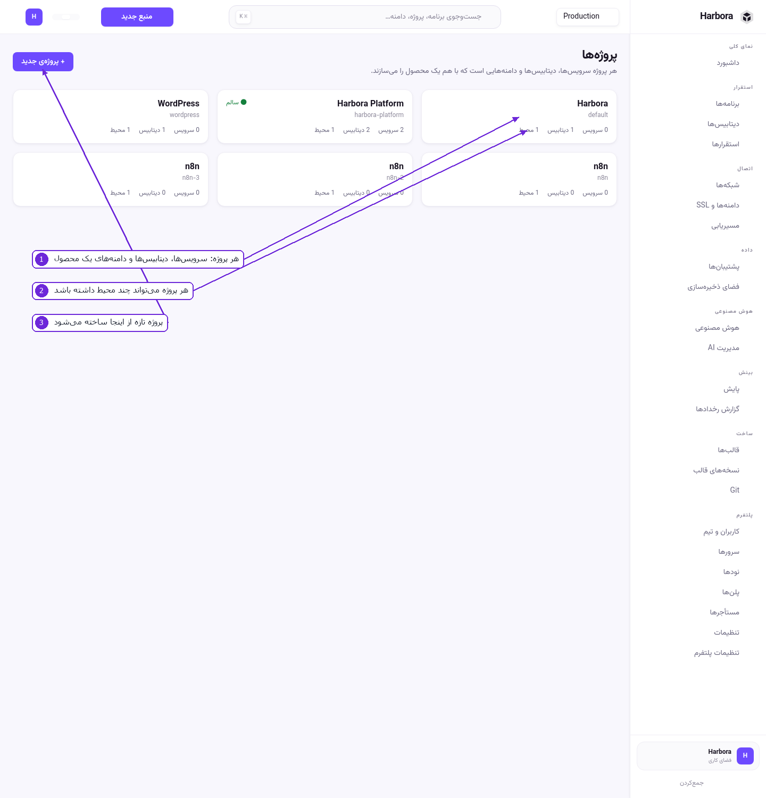
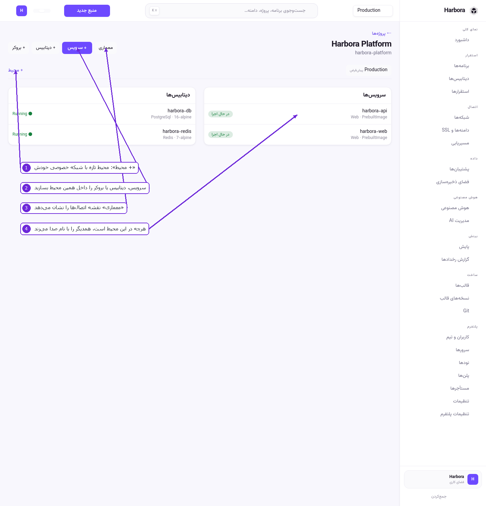
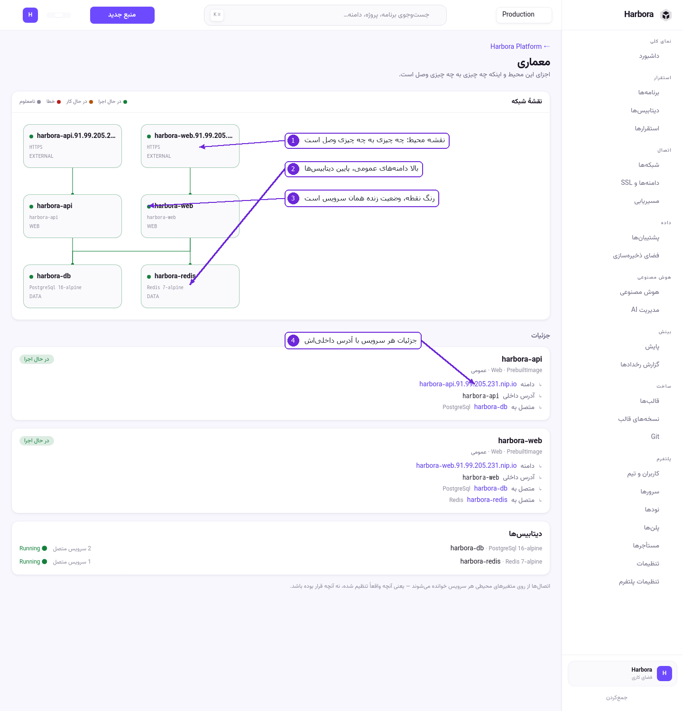
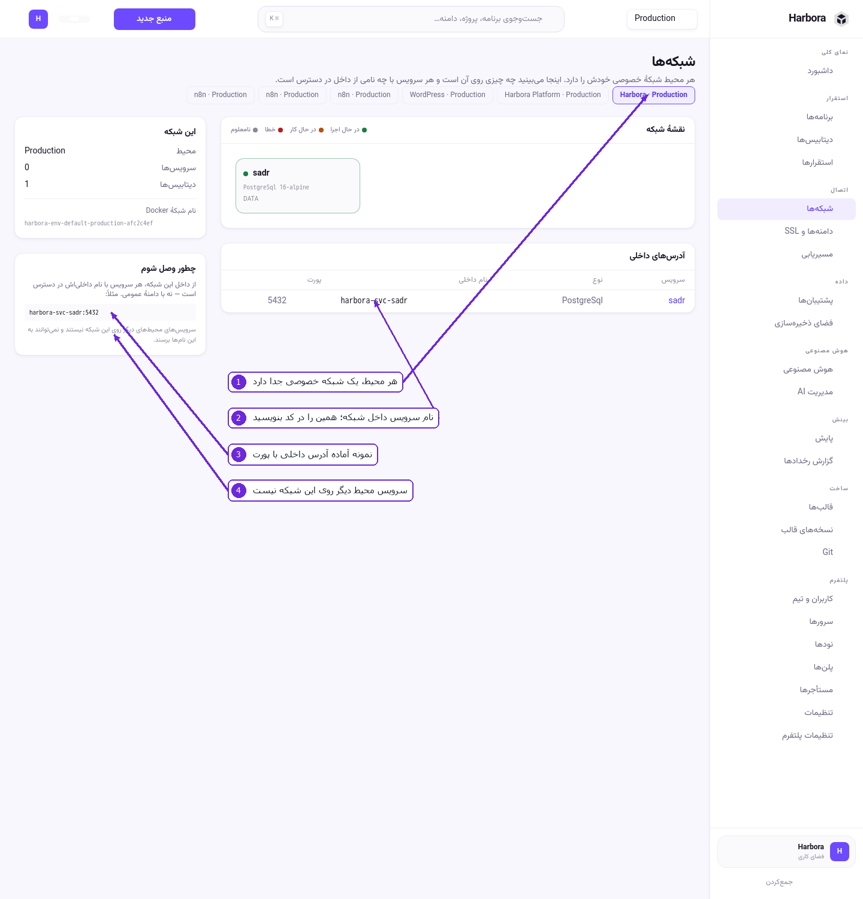

# ۲ — پروژه، محیط و شبکهٔ خصوصی

این بخش، همان چیزی است که معمولاً گیج‌کننده است: «چرا اپ من به این دیتابیس وصل نمی‌شود؟» جوابش
تقریباً همیشه یک جمله است — **در یک محیط نیستند**.

## سه لایه

```
فضای کاری  ─┬─ پروژه «فروشگاه» ─┬─ محیط production ─┬─ اپ web
            │                    │                   ├─ اپ api
            │                    │                   └─ دیتابیس orders
            │                    └─ محیط staging ────┬─ اپ web
            │                                        └─ دیتابیس orders
            └─ پروژه «وبلاگ» ────── محیط production ── اپ blog
```

* **پروژه** فقط برای دسته‌بندی است.
* **محیط** چیزی است که واقعاً اهمیت دارد: هر محیط یک **شبکهٔ خصوصی Docker** جداگانه دارد.
* هرچه داخل یک محیط است، همدیگر را با نام صدا می‌زند. هرچه بیرون آن است، اصلاً روی آن شبکه نیست.

## فهرست پروژه‌ها



۱. هر کارت یک پروژه است، با شمارهٔ سرویس‌ها، دیتابیس‌ها و محیط‌هایش.
۲. یک پروژه می‌تواند چند محیط داشته باشد؛ عدد «محیط» همان است.
۳. **+ پروژهٔ جدید** — فقط یک نام می‌خواهد. با ساختنش، یک محیط `production` هم خودکار ساخته می‌شود.

## داخل یک پروژه



۱. **+ محیط** — محیط تازه با شبکهٔ خصوصی مخصوص خودش. برای `staging` یا `dev` همین را بزنید.
۲. **+ سرویس / + دیتابیس / + بروکر** — همین‌جا بسازید تا مستقیم داخل همین محیط بیفتند. اگر از صفحهٔ
   «برنامه‌ها» بسازید هم همان است، فقط باید پروژه و محیط را دستی انتخاب کنید.
۳. **معماری** — نقشهٔ اتصال‌ها.
۴. هرچه در این محیط است در یک شبکه است و می‌تواند بقیه را با نام صدا بزند.

### ساخت محیط، قدم‌به‌قدم

1. وارد پروژه شوید.
2. **+ محیط** را بزنید.
3. نام را بنویسید — `staging`، `dev`، هرچه. حروف کوچک و خط تیره.
4. ذخیره کنید. Harbora بلافاصله یک شبکهٔ Docker با نامی مثل
   `harbora-env-<project>-<environment>-<id>` می‌سازد.
5. حالا داخل همین محیط سرویس و دیتابیس بسازید.

> محیط، چیزی جز یک مرز نیست. سرویس‌های `production` و `staging` می‌توانند نام یکسان داشته باشند،
> چون در دو شبکهٔ جدا هستند و به هم نمی‌رسند.

### کپی گرفتن از یک محیط

اگر می‌خواهید `staging` دقیقاً شکل `production` باشد، لازم نیست دوباره همه را دستی بسازید.
روی نوار محیط‌ها، **کپی این محیط** را بزنید.

پیش از ساختن، صفحه دقیقاً همان چیزی را نشان می‌دهد که ساخته می‌شود: فهرست سرویس‌ها با نام تازه‌شان،
فهرست دیتابیس‌ها، و اینکه چقدر از سهمیهٔ پلن برداشته می‌شود. سهمیه **یک‌جا** بررسی می‌شود — نه
سرویس‌به‌سرویس — چون نصفه‌کپی از هیچ‌کپی بدتر است.

چه چیزی **منتقل نمی‌شود** (و صفحه هم همین را می‌گوید):

| | چرا |
|---|------|
| **دامنه‌ها** | یک نام دامنه به یک جا اشاره می‌کند. کپی زیردامنهٔ خودکار خودش را می‌گیرد. |
| **محتوای والیوم‌ها** | والیوم با همان مسیر ساخته می‌شود ولی **خالی** است. کپی‌شدن بی‌صدای دادهٔ مشتری به محیطی با مراقبت کمتر، کاری نیست که با یک دکمه انجام شود. |
| **رمز دیتابیس‌ها** | هر دیتابیس رمز **تازه** می‌گیرد و متغیرهای اتصال دوباره برای همین کپی نوشته می‌شوند. |
| **تاریخچهٔ استقرار، preview ها، اندازه‌های سنجیده‌شده** | این‌ها دربارهٔ نسخهٔ اصلی‌اند. |

نکته‌ها:

* متغیرهای خود اپ (مثل `APP_SECRET`) منتقل می‌شوند؛ فقط آن‌هایی که با اتصال دیتابیس نوشته شده بودند
  دوباره ساخته می‌شوند. اگر این کار نمی‌شد، کپی بالا می‌آمد و بی‌سروصدا به دیتابیس production وصل
  می‌شد — و همه‌چیز هم درست به‌نظر می‌رسید.
* محیط تازه هیچ‌وقت **پیش‌فرض** یا **محافظت‌شده** نمی‌شود، حتی اگر اصل آن باشد.
* اگر جایی وسط کار کم بیاید — سهمیه، ظرفیت نود — هیچ‌چیز ساخته نمی‌شود، نه نصفش.
* کپی در **گزارش رخدادها** با نام `environment.cloned` ثبت می‌شود.

## نقشهٔ معماری



۱. **نقشهٔ شبکه** — چه چیزی به چه چیزی وصل است.
۲. ردیف بالا دامنه‌های عمومی (`EXTERNAL`)، ردیف میانی سرویس‌ها (`WEB`)، ردیف پایین داده (`DATA`).
۳. رنگ نقطهٔ کنار هر جعبه، وضعیت زندهٔ همان سرویس است: سبز در حال اجرا، نارنجی در حال کار، قرمز خطا،
   خاکستری نامعلوم.
۴. زیر نقشه، جزئیات هر سرویس با **آدرس داخلی**‌اش می‌آید — همان چیزی که در کد می‌نویسید.

اگر خطی که انتظار دارید نیست، یعنی آن اتصال واقعاً برقرار نشده؛ نقشه از روی وضعیت واقعی کشیده می‌شود
نه از روی چیزی که قرار بوده باشد.

## شبکه‌ها



۱. بالای صفحه، هر محیط یک دکمه است. با زدنش شبکهٔ همان محیط را می‌بینید.
۲. **آدرس‌های داخلی** — نام داخلی هر سرویس. همین رشته را در کد یا در متغیر محیطی بنویسید.
۳. **چطور وصل شوم** یک نمونهٔ آماده می‌دهد، مثلاً `harbora-svc-sadr:5432`.
۴. صریح نوشته است: سرویس‌های محیط‌های دیگر روی این شبکه نیستند و با این نام‌ها پیدا نمی‌شوند.

### قانون‌های اتصال

| از | به | کار می‌کند؟ |
|----|-----|------------|
| اپ در `production` | دیتابیس در `production` (همان پروژه) | بله، با نام داخلی |
| اپ در `production` | دیتابیس در `staging` | نه — دو شبکهٔ جدا |
| اپ در پروژهٔ الف | دیتابیس در پروژهٔ ب، هر دو `production` | نه — محیط‌ها جدا هستند |
| هر جایی | یک اپ از طریق دامنهٔ عمومی‌اش | بله، ولی از مسیر اینترنت |

### وقتی اتصال رد می‌شود

اگر موقع وصل‌کردن یک دیتابیس به اپ، پیام رد گرفتید، دلیلش عبور از مرز محیط است. دو راه دارید:

* **دیتابیس را به همان محیط ببرید** — در صفحهٔ اپ، بخش «دیتابیس‌ها در محیط‌های دیگر»، لینک «انتقال»
  کنار همان دیتابیس هست. با زدنش دیتابیس روی شبکهٔ محیط اپ می‌آید و بعد قابل اتصال می‌شود.
* **یا اپ را در محیطی بسازید که دیتابیس آنجاست.**

انتقال، کانتینر دیتابیس را دوباره به شبکهٔ تازه وصل می‌کند؛ داده‌ها دست‌نخورده می‌مانند چون والیوم
عوض نمی‌شود.

---

قدم بعدی: [اپلیکیشن‌ها](03-applications.md)
