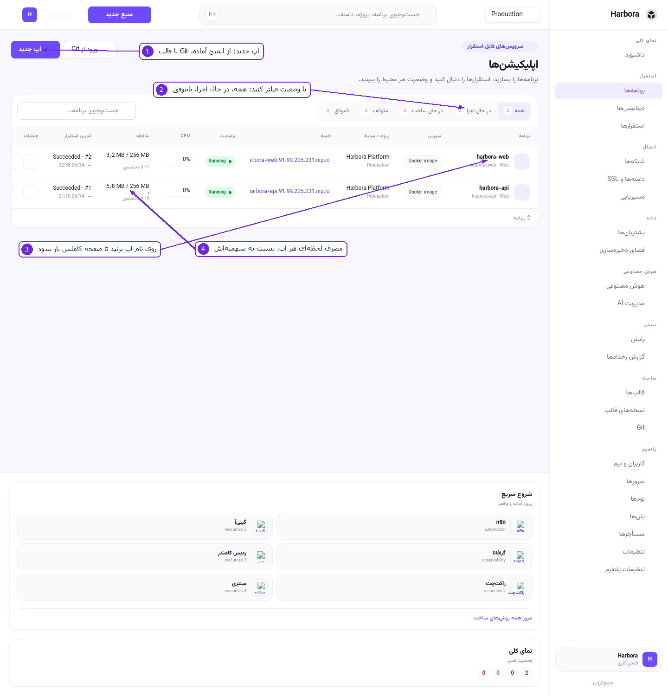
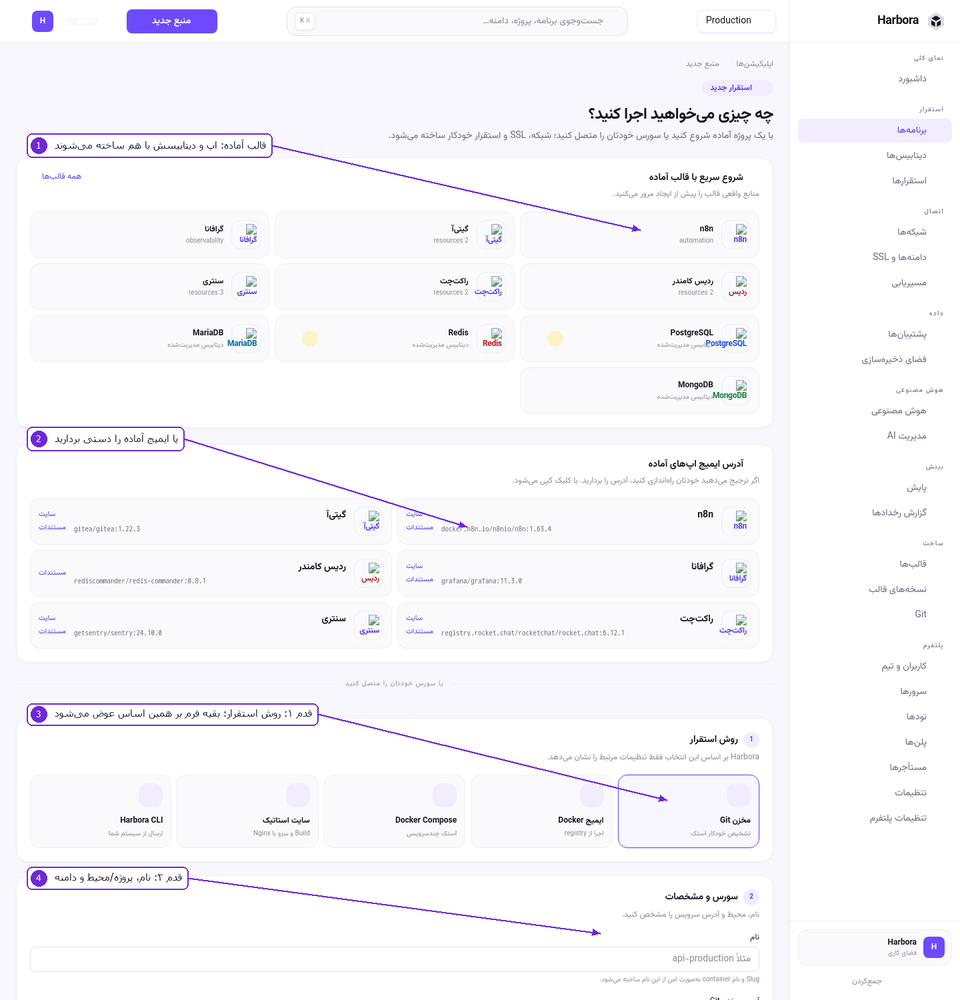
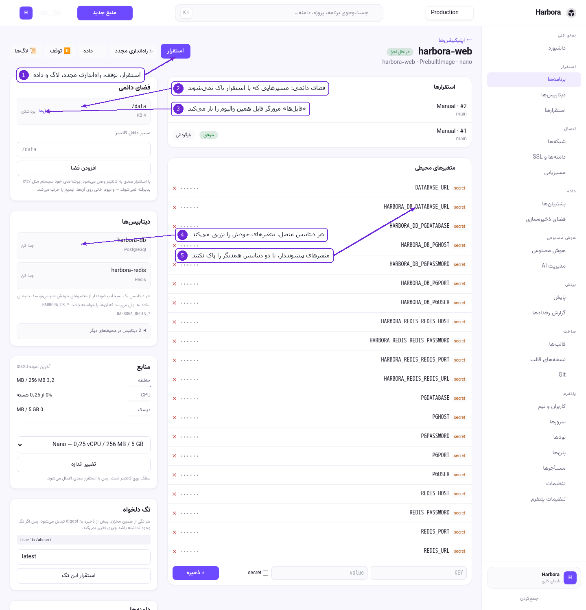
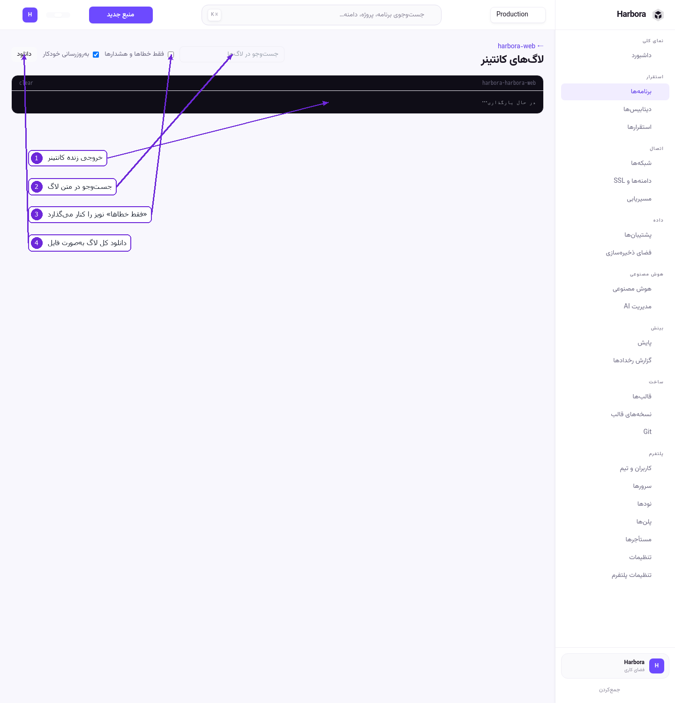
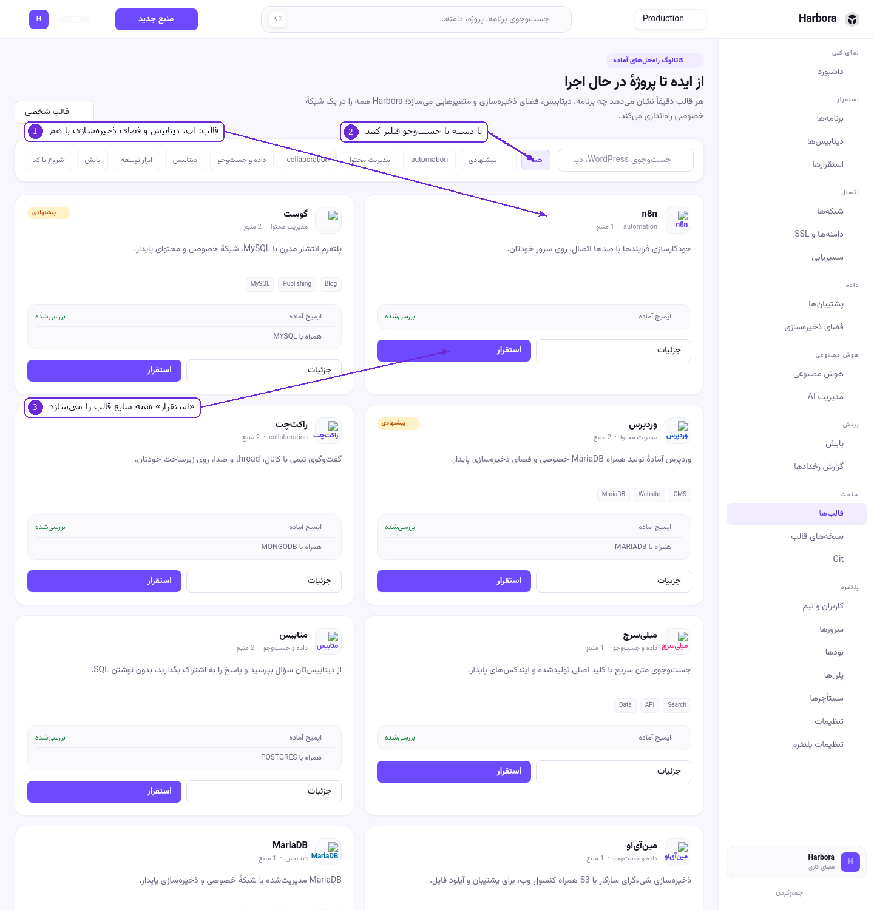

# ۳ — اپلیکیشن‌ها

## فهرست برنامه‌ها

۱. **اپ جدید** — فرم ساخت. **ورود از Git** میان‌بری است به همان فرم با روش «مخزن Git».
۲. **فیلتر وضعیت** — همه، در حال اجرا، در حال ساخت، متوقف، ناموفق. عددِ کنار هر کدام واقعی است.
۳. روی **نام اپ** بزنید تا صفحهٔ کاملش باز شود.
۴. ستون **CPU** و **حافظه** مصرف لحظه‌ای را نسبت به سقفِ همان اپ نشان می‌دهد. اگر چیزی هنوز
   اندازه‌گیری نشده باشد، خط تیره می‌بینید نه صفر — «نمی‌دانم» با «صفر» یکی نیست.

## ساخت اپ

۱. **شروع سریع با قالب آماده** — بالای صفحه. یک قالب، اپ و دیتابیس و فضای ذخیره‌سازی‌اش را با هم
   می‌سازد. ساده‌ترین راه برای شروع.
۲. **آدرس ایمیج اپ‌های آماده** — اگر ترجیح می‌دهید خودتان راه‌اندازی کنید، آدرس ایمیج را از اینجا
   بردارید.
۳. **قدم ۱ — روش استقرار.** انتخابتان تعیین می‌کند بقیهٔ فرم چه چیزی بپرسد:

   | روش | چه وقت | چه می‌خواهد |
   |-----|---------|--------------|
   | **مخزن Git** | کد خودتان، ساخت روی سرور | آدرس مخزن، شاخه، مسیر Dockerfile |
   | **ایمیج Docker** | ایمیج آمادهٔ از قبل ساخته | آدرس ایمیج و تگ |
   | **Docker Compose** | استک چندسرویسی | فایل compose |
   | **سایت استاتیک** | خروجی build، سرو با Nginx | مخزن و دستور build |
   | **Harbora CLI** | ارسال از سیستم خودتان | چیزی — بعداً با CLI پوش می‌کنید (چک‌لیست کامل: [فصل ۱۲](12-cli-deploy.md)) |

۴. **قدم ۲ — سورس و مشخصات.**
   * **نام** — از همین، slug و نام container ساخته می‌شود.
   * **پروژه و محیط** — این انتخاب، مرزِ شبکهٔ خصوصی سرویس را تعیین می‌کند. اگر قرار است به یک
     دیتابیس موجود وصل شود، همان محیط را انتخاب کنید.
   * **دامنه** — خالی بگذارید تا خودکار ساخته شود؛ SSL هم خودکار می‌آید.

پایین‌تر: **تنظیمات Build و Runtime** (شاخه، Dockerfile، توکن مخزن خصوصی، پورت داخلی، نوع سرویس) و
**اندازهٔ منبع** — CPU، حافظه و دیسکِ همان تیر. اندازه‌ها را مدیر تعریف می‌کند و پلنِ شما تعیین
می‌کند کدام‌ها مجازند.

### قدم‌به‌قدم: اولین اپ

1. **برنامه‌ها** › **اپ جدید**.
2. روش را انتخاب کنید — برای اولین بار «ایمیج Docker» ساده‌ترین است.
3. نام بگذارید، مثلاً `web`.
4. پروژه و محیط را انتخاب کنید.
5. آدرس ایمیج را بنویسید، مثلاً `traefik/whoami`.
6. اندازه را انتخاب کنید.
7. **ساخت** را بزنید. Harbora ایمیج را می‌کشد، container را بالا می‌آورد، شبکه را وصل می‌کند، دامنه
   می‌سازد و گواهی می‌گیرد.

## صفحهٔ اپ

۱. **نوار عملیات** — استقرار، توقف، راه‌اندازی مجدد، **لاگ‌ها** و **داده**.
۲. **فضای دائمی** — مسیرهایی که با استقرار بعدی پاک نمی‌شوند. مسیر داخل کانتینر را بنویسید (مثلاً
   `/data`) و **افزودن فضا** را بزنید. با استقرار بعدی وصل می‌شود.

   > روی پوشه‌های خود سیستم (مثل `/etc`) والیوم نگذارید؛ والیوم خالی روی آن‌ها ایمیج را خراب می‌کند.

۳. **فایل‌ها** — مرورگر فایل همان والیوم. در [بخش فضای ذخیره‌سازی](05-storage.md) توضیح داده شده.
۴. **دیتابیس‌ها** — هر دیتابیسِ متصل، متغیرهای اتصال خودش را تزریق می‌کند. با **جدا کن** قطع
   می‌شود، و از فهرست پایین می‌توانید دیتابیس دیگری وصل کنید.
۵. **متغیرهای پیشونددار** — هر دیتابیس یک نسخهٔ پیشونددار هم می‌نویسد (`HARBORA_DB_*`,
   `HARBORA_REDIS_*`). نام‌های ساده (`DATABASE_URL`, `PGHOST`) به اولی می‌رسد که آن‌ها را خواسته
   باشد. برای همین است که می‌شود دو دیتابیس از یک موتور را به یک اپ وصل کرد بدون اینکه دومی
   تنظیمات اولی را پاک کند.

پایین‌تر در همین صفحه:

* **منابع** — حافظه، CPU و دیسک مصرفی نسبت به سقفشان، و نمودار هرکدام. با **تغییر اندازه** تیرِ
  دیگری بدهید؛ با استقرار بعدی اعمال می‌شود.
* **متغیرهای محیطی** — کلید و مقدار. تیک `secret` مقدار را رمزنگاری‌شده نگه می‌دارد و دیگر نشانش
  نمی‌دهد.
* **تگ دلخواه** — تگ ایمیج به digest تبدیل می‌شود، پس اگر تگ عوض شود چیزی زیر پای شما تغییر
  نمی‌کند.
* **دامنه‌ها** — دامنهٔ اضافه روی همین اپ.
* **استقرارها** — تاریخچه، با **بازگردانی** روی هر نسخهٔ موفق قبلی.

## لاگ‌ها

۱. خروجی زندهٔ کانتینر.
۲. **جست‌وجو** در متن لاگ.
۳. **فقط خطاها و هشدارها** — نویز را کنار می‌گذارد.
۴. **دانلود** — کل لاگ به‌صورت فایل، برای وقتی می‌خواهید جای دیگری بررسی‌اش کنید.

**به‌روزرسانی خودکار** روشن است تا لاگ زنده بیاید؛ اگر می‌خواهید صفحه ثابت بماند خاموشش کنید.

## استقرار مجدد و بازگردانی

* **استقرار** — همان تنظیمات فعلی را دوباره اجرا می‌کند (برای Git: آخرین commit شاخه).
* **بازگردانی** — روی هر استقرار موفق قبلی در تاریخچه. همان ایمیج/commit را برمی‌گرداند.
* **توقف** — کانتینر خاموش می‌شود ولی چیزی پاک نمی‌شود؛ والیوم‌ها و دامنه سر جایشان می‌مانند.

## قالب‌ها

۱. هر قالب یک راه‌حل کامل است، نه فقط یک ایمیج: اپ، دیتابیس، فضای ذخیره‌سازی و متغیرهایش را با هم
   می‌سازد و همه را در یک شبکهٔ خصوصی می‌گذارد. زیر نام هر قالب نوشته چند منبع می‌سازد.
۲. با **دسته** (پیشنهادی، automation، مدیریت محتوا، دیتابیس، داده و جست‌وجو، ابزار توسعه، پایش،
   collaboration، شروع با کد) یا با **جست‌وجو** فیلتر کنید.
۳. **جزئیات** می‌گوید دقیقاً چه چیزی ساخته می‌شود؛ **استقرار** همه را می‌سازد.

نشان **بررسی‌شده** یعنی ایمیج قالب به یک digest مشخص سنجاق شده و همان چیزی نصب می‌شود که آزمایش شده
است. با **قالب شخصی** می‌توانید قالب خودتان را تعریف کنید.

### قدم‌به‌قدم: استقرار WordPress

1. **قالب‌ها** › روی کارت «وردپرس» **استقرار** را بزنید.
2. نام و پروژه/محیط را بدهید.
3. تأیید کنید. Harbora یک MariaDB، یک اپ WordPress، یک والیوم دائمی و یک دامنه می‌سازد و همه را به
   هم وصل می‌کند.
4. وقتی وضعیت «در حال اجرا» شد، دامنه را باز کنید.

## محافظت از دسترسی (رمز و محدودیت IP)

روی صفحهٔ اپ، بخش **محافظت از دسترسی**. برای سایت staging، پیش‌نمایشی که مشتری می‌بیند، یا ابزار
داخلی — چیزی که نباید روی اینترنت باز باشد ولی دامنه لازم دارد.

* **محافظت با رمز** — نام کاربری (پیش‌فرض `admin`) و رمز. مرورگر پیش از رسیدن به اپ رمز می‌پرسد؛
  بدون رمز، جواب ۴۰۱ است نه صفحهٔ اپ.
* **فقط این IP‌ها** — آدرس یا رنج، با ویرگول: `203.0.113.5, 10.0.0.0/8`. خالی یعنی همه.

نکته‌ها:

* روی **همهٔ** دامنه‌های این اپ اعمال می‌شود؛ محافظت از یکی از سه دامنه محافظت نیست.
* اگر ورودی نامعتبری بنویسید، پنل **همان ورودی را با نام** برمی‌گرداند، نه «لیست نامعتبر».
* رمز ذخیره‌شده هیچ‌وقت دوباره نمایش داده نمی‌شود؛ برای عوض‌کردنِ فقط IP، فیلد رمز را خالی
  بگذارید تا دست نخورد.
* اگر Traefik پیکربندی را نپذیرد، پنل همان را می‌گوید — «ذخیره شد» وقتی ترافیک عوض نشده، بدترین
  جواب ممکن است.

## ترمینال وب

> این امکان **به‌صورت پیش‌فرض خاموش است**. اگر دکمه‌اش را نمی‌بینید، اپراتور پلتفرم روشنش نکرده
> (`Features:Terminal` در تنظیمات سرور).

دکمهٔ **ترمینال** در نوار بالای صفحهٔ اپ، یک پوستهٔ زنده داخل همان کانتینری باز می‌کند که همین
حالا به کاربران سرویس می‌دهد. برای وقتی که لاگ کافی نیست: دیدن فایل واقعی، اجرای یک دستور مدیریتی،
تست اینکه اپ به دیتابیس می‌رسد یا نه.

قبل از استفاده، این‌ها را بدانید:

* هرچه بنویسید **روی کانتینر در حال سرویس** اجرا می‌شود. این محیط آزمایشی نیست.
* تغییر روی فایل‌سیستم کانتینر با **استقرار بعدی از بین می‌رود** — مگر روی یک والیوم باشد.
* باز و بسته شدن نشست در **گزارش رخدادها** ثبت می‌شود (`app.terminal_opened` و
  `app.terminal_closed` با مدت زمان). این عمدی است: ترمینالی که نشود ثابت کرد باز شده، از نبودنش
  بدتر است.
* نشست بی‌استفاده بعد از **۱۵ دقیقه** بسته می‌شود، و هر نشستی بعد از **۴ ساعت**. خروجی یک دستور
  طولانی هم «استفاده» حساب می‌شود، پس دستور کند نشست را نمی‌بندد.
* دسترسی لازم: هم `apps.env` و هم `apps.operate`. یک پوسته هم متغیرها و رمزها را نشان می‌دهد و هم
  می‌تواند پروسه را بخواباند؛ نقشی که فقط نصفِ این را دارد، این در را باز نمی‌کند.
* دستور اجراشده **ثابت** است (`bash` اگر ایمیج داشته باشد، وگرنه `sh`). دستور از سمت مرورگر گرفته
  نمی‌شود.

**اپ روی نود ترمینال ندارد.** صفحه همین را می‌گوید و دکمه به جایی که کار نمی‌کند نمی‌برد — نسخهٔ ۱
پروتکل Agent کانال دوطرفه ندارد.

**ایمیج بدون پوسته ترمینال ندارد.** ایمیج‌هایی که از `scratch` یا distroless ساخته شده‌اند (مثلاً
`traefik/whoami`) اصلاً `/bin/sh` ندارند. در این حالت خودِ پیام docker داخل ترمینال نوشته می‌شود:
`exec: "/bin/sh": stat /bin/sh: no such file or directory`. این عمدی است — چیزی برای اجرا وجود
ندارد و پنل به‌جای پنهان کردنش، همان دلیل واقعی را نشان می‌دهد.

## نکته دربارهٔ نودها

اگر اپ را روی یک **نود** (سرور دیگری که Agent روی آن نصب است) اجرا کنید:

* اپ از **ایمیج آماده** و **قالب** کار می‌کند.
* اپ از **مخزن Git** روی نود ساخته **نمی‌شود** — نود عمداً build ندارد. ایمیج را جای دیگری بسازید و
  آدرسش را بدهید.

---

قدم بعدی: [دیتابیس و بروکر](04-databases-and-brokers.md)
