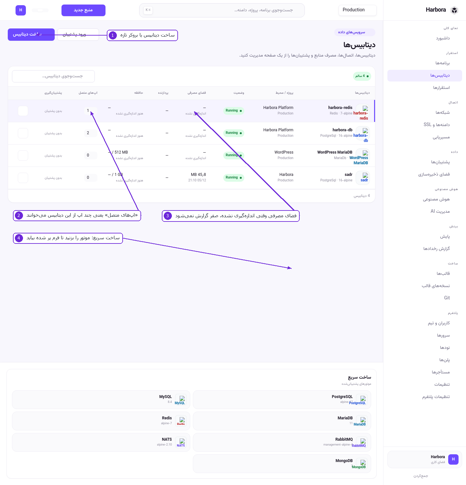
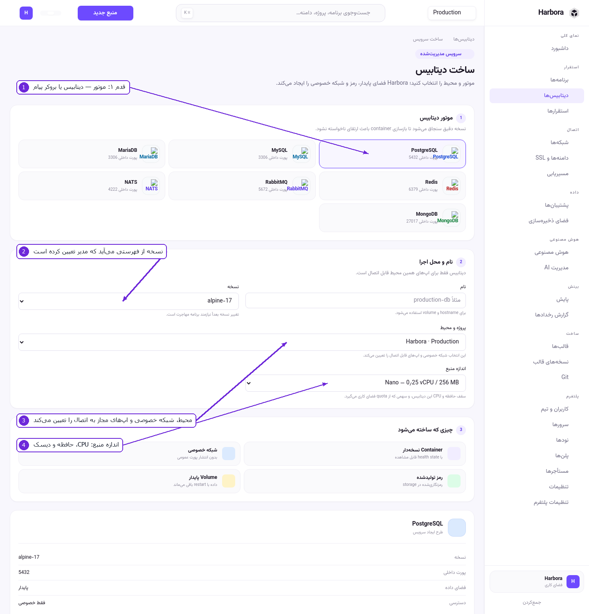
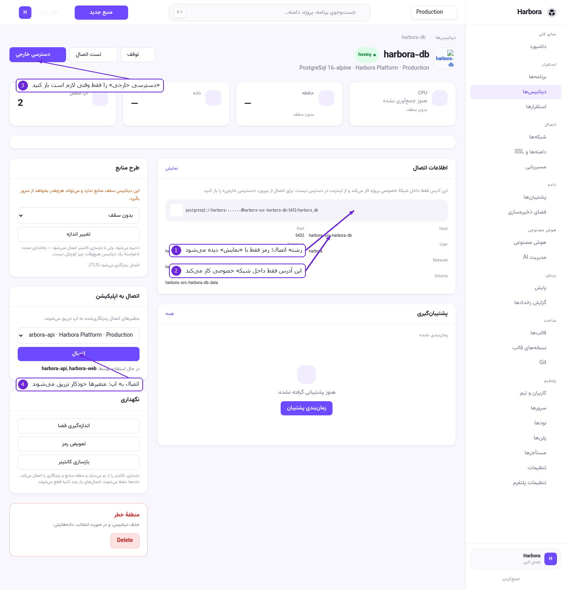

# ۴ — دیتابیس و بروکر پیام

## فهرست دیتابیس‌ها



۱. **ساخت دیتابیس** — فرم ساخت. **ورود پشتیبان** یک فایل پشتیبان موجود را برمی‌گرداند.
۲. **اپ‌های متصل** — چند اپ از این دیتابیس می‌خوانند. عدد صفر یعنی هیچ اپی وصل نیست.
۳. **فضای مصرفی** و **حافظه** — اگر هنوز اندازه‌گیری نشده باشد، «اندازه‌گیری نشده» می‌نویسد نه صفر.
۴. **ساخت سریع** — روی موتور بزنید تا فرم با همان موتور پر شده باز شود.

## ساخت دیتابیس



۱. **قدم ۱ — موتور.** هفت موتور پشتیبانی می‌شود، با پورت داخلی هرکدام:

   | موتور | پورت | کاربرد |
   |-------|------|--------|
   | PostgreSQL | 5432 | دیتابیس رابطه‌ای |
   | MySQL | 3306 | دیتابیس رابطه‌ای |
   | MariaDB | 3306 | دیتابیس رابطه‌ای |
   | MongoDB | 27017 | سندگرا |
   | Redis | 6379 | کش و صف سبک |
   | RabbitMQ | 5672 | بروکر پیام |
   | NATS | 4222 | بروکر پیام |

۲. **نسخه** — از فهرستی می‌آید که مدیر در **نسخه‌های قالب** تعیین کرده است. نسخه دقیق سنجاق می‌شود
   تا بازسازی container باعث ارتقای ناخواسته نشود. عوض‌کردن نسخه بعداً یعنی مهاجرت، پس همین حالا
   درست انتخابش کنید.
۳. **پروژه و محیط** — همان مرزی که در [بخش ۲](02-projects-and-environments.md) گفته شد. این انتخاب
   تعیین می‌کند کدام اپ‌ها اجازهٔ اتصال دارند.
۴. **اندازهٔ منبع** — سقف حافظه و CPU این دیتابیس، و سهمش از quota فضای کاری.

پایین‌تر، بخش **چیزی که ساخته می‌شود** دقیقاً می‌گوید چه container، چه والیوم و چه شبکه‌ای ساخته
خواهد شد.

### قدم‌به‌قدم

1. **دیتابیس‌ها** › **ساخت دیتابیس**.
2. موتور را بزنید.
3. نام بگذارید — از همین، hostname و نام والیوم ساخته می‌شود.
4. نسخه، پروژه/محیط و اندازه را انتخاب کنید.
5. **ساخت**. رمز خودکار ساخته و رمزنگاری‌شده نگه داشته می‌شود.

## صفحهٔ دیتابیس



۱. **اطلاعات اتصال** — رشتهٔ اتصال کامل. رمز پنهان است و فقط با **نمایش** دیده می‌شود.
۲. این آدرس **فقط داخل شبکهٔ خصوصی** کار می‌کند. از اینترنت در دسترس نیست، و همین درست است.
۳. **دسترسی خارجی** — اگر واقعاً لازم دارید (مثلاً برای وصل‌شدن با یک ابزار گرافیکی از لپ‌تاپ)،
   از اینجا باز کنید. تا وقتی لازم نیست بسته بماند.
۴. **اتصال به اپلیکیشن** — اپ را انتخاب و **اتصال** را بزنید؛ متغیرهای رمزنگاری‌شده تزریق می‌شوند.
   زیرش می‌نویسد همین حالا چه اپ‌هایی از آن استفاده می‌کنند.

بقیهٔ صفحه: **طرح منابع** (سقف حافظه و تغییر اندازه)، **پشتیبان‌گیری** (زمان‌بندی و تاریخچه) و
**نگهداری** (اندازه‌گیری فضا، توقف، حذف).

## ابزار مدیریت (نگاه‌کردن به جدول‌ها)

دکمهٔ **ابزار مدیریت** روی صفحهٔ دیتابیس — برای PostgreSQL، MySQL و MariaDB. با یک کلیک یک
Adminer موقت بالا می‌آید:

1. آدرس، نام کاربری و رمزِ **ابزار** یک‌بار نشان داده می‌شود (این رمزِ دیتابیس نیست).
2. آدرس را باز کنید؛ مرورگر همان رمز را می‌پرسد.
3. در فرم Adminer، رمزِ **دیتابیس** را می‌خواهد — آن را از بخش «اطلاعات اتصال» با «نمایش» بردارید.

قاعده‌های ایمنی که ندیدنشان مهم است:

* ابزار روی **شبکهٔ خصوصی همان محیط** اجرا می‌شود؛ به آن دیتابیس می‌رسد و به هیچ‌چیز دیگر.
* بدون رمز، آدرس ۴۰۱ می‌دهد — نه فرم ورودی روی دادهٔ کسی.
* **بعد از یک ساعت خودش پاک می‌شود** (هم کانتینر، هم آدرس). بستنِ تب چیزی را باز نمی‌گذارد.
* هر بار که بازش کنید رمز تازه می‌گیرد؛ رمزی که یک ساعت پیش روی صفحه بود، مرده است.
* Redis، MongoDB، RabbitMQ و NATS دکمه ندارند — این ابزار زبانشان را نمی‌داند و دکمه‌ای که به
  «unknown driver» ختم شود از نبودنش بدتر است.

## یک اپ به چند دیتابیس، یک دیتابیس به چند اپ

هر دو حالت پشتیبانی می‌شود.

**یک اپ به چند دیتابیس.** در صفحهٔ اپ، بخش «دیتابیس‌ها»، هرچندتا که خواستید وصل کنید. برای اینکه
دومی متغیرهای اولی را پاک نکند، هر اتصال یک مجموعهٔ **پیشونددار** هم می‌نویسد:

```
DATABASE_URL              ← اولین دیتابیسی که این نام را خواسته
HARBORA_DB_DATABASE_URL   ← دیتابیس harbora-db
HARBORA_DB_PGHOST
ORDERS_DATABASE_URL       ← دیتابیس orders
ORDERS_PGHOST
```

پیشوند از نام خود دیتابیس ساخته می‌شود: `orders` → `ORDERS_`. اگر نام با رقم شروع شود، یک زیرخط
جلویش می‌آید (`2nd-cache` → `_2ND_CACHE_`) تا نام متغیر معتبر بماند.

در کد، بهتر است همیشه از نام پیشونددار استفاده کنید؛ آن یکی هیچ‌وقت جابه‌جا نمی‌شود.

**یک دیتابیس به چند اپ.** از صفحهٔ خود دیتابیس، بخش «اتصال به اپلیکیشن»، اپ بعدی را انتخاب و وصل
کنید. همین کار از صفحهٔ اپ هم شدنی است — دو طرفِ یک رابطه‌اند.

**شرط هر دو:** اپ و دیتابیس باید در یک محیط باشند. اگر نبودند، پنل رد می‌کند و لینک «انتقال» را
نشان می‌دهد.

## بروکرهای پیام

RabbitMQ و NATS دقیقاً مثل دیتابیس ساخته و وصل می‌شوند. متغیرهایشان هم به همان شکل تزریق می‌شود
(`*_AMQP_URL` برای RabbitMQ، `*_NATS_URL` برای NATS). RabbitMQ نسخهٔ `management` را می‌گیرد، پس
کنسول مدیریتی‌اش هم بالا می‌آید.

## دیتابیس روی نود

دیتابیس هم می‌تواند روی یک نود اجرا شود، نه فقط روی سرور محلی. در فرم ساخت، اگر بیش از یک سرور دارید
انتخابگر سرور می‌آید و زمان‌بند بر اساس ظرفیت آزاد جا پیدا می‌کند.

---

قدم بعدی: [فضای ذخیره‌سازی](05-storage.md)
