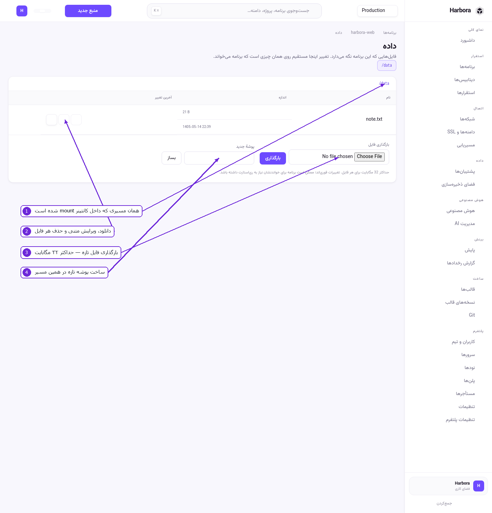
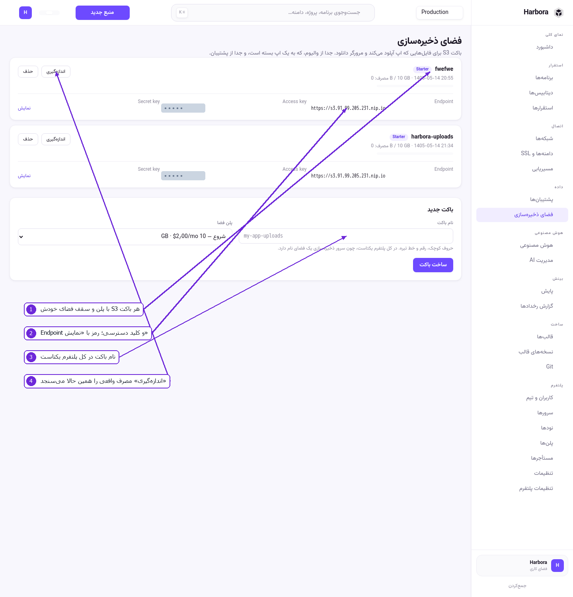

# ۵ — فضای ذخیره‌سازی

Harbora سه جور نگه‌داری داده دارد و هرکدام کار خودش را می‌کند:

| | چیست | چه وقت |
|---|------|---------|
| **والیوم** | پوشه‌ای که به کانتینر mount می‌شود | فایل‌هایی که خودِ اپ می‌نویسد و نباید با استقرار پاک شوند |
| **باکت S3** | فضای شیءگرا با کلید دسترسی | آپلود کاربران، فایل‌های حجیم، چیزی که چند اپ می‌خوانند |
| **پشتیبان** | نسخهٔ زمان‌دار برای بازگردانی | فاجعه، اشتباه، مهاجرت |

## والیوم — فضای دائمی اپ

در صفحهٔ اپ، بخش **فضای دائمی**:

1. مسیر داخل کانتینر را بنویسید، مثلاً `/data` یا `/app/uploads`.
2. **افزودن فضا** را بزنید.
3. با **استقرار بعدی** والیوم وصل می‌شود.

قانون‌ها:

* مسیر باید مطلق باشد.
* روی پوشه‌های خود سیستم (`/etc`، `/usr`، …) پذیرفته نمی‌شود — والیوم خالی روی آن‌ها ایمیج را خراب
  می‌کند.
* **برداشتن** والیوم را از اپ جدا می‌کند.

## مرورگر فایل داخل اپ

دکمهٔ **داده** در نوار بالای صفحهٔ اپ (یا لینک «فایل‌ها» کنار هر والیوم) این صفحه را باز می‌کند:



۱. همان مسیری که داخل کانتینر mount شده است. اگر اپ چند والیوم دارد، از بالای صفحه بینشان جابه‌جا
   شوید.
۲. برای هر فایل: **دانلود**، **ویرایش** (برای فایل متنی، همان‌جا در مرورگر) و **حذف**.
۳. **بارگذاری فایل** — حداکثر ۳۲ مگابایت برای هر فایل.
۴. **پوشهٔ جدید** — پوشه در همین مسیر ساخته می‌شود.

نکته‌ها:

* تغییرات **فوری** روی همان والیومِ در حال استفاده می‌نشیند. اپ‌هایی که فایل را در شروع می‌خوانند،
  تا ری‌استارت نشوند تغییر را نمی‌بینند.
* بیرون رفتن از مسیر والیوم ممکن نیست؛ `..` و مسیر مطلق رد می‌شوند.
* هر نوشتن و حذف در **گزارش رخدادها** ثبت می‌شود. این صفحه دسترسی مستقیم به دادهٔ مشتری است و
  سخت‌گیرانه‌ترین سطح دسترسی پنل را دارد.

## باکت S3



۱. هر باکت با **پلن فضا** و سقفِ خودش. مصرف، در برابر همان سقف نشان داده می‌شود.
۲. **Endpoint** و **Access key** پیداست؛ **Secret key** فقط با **نمایش** دیده می‌شود.
۳. **نام باکت** در کل پلتفرم یکتاست، چون یک سرور ذخیره‌سازی مشترک است. حروف کوچک، رقم و خط تیره.
۴. **اندازه‌گیری** مصرف واقعی را همین حالا می‌سنجد؛ در حالت عادی خودکار و طبق زمان‌بندی سنجیده
   می‌شود.

### ساخت باکت

1. **فضای ذخیره‌سازی** › نام باکت را بنویسید.
2. پلن فضا را انتخاب کنید (سقف و قیمتش را همان‌جا می‌نویسد).
3. **ساخت باکت**. Harbora باکت را می‌سازد، یک کاربر مخصوص همان باکت با کلید جداگانه درست می‌کند و
   سقف فضا را روی خود سرور اعمال می‌کند.

### مرورگر اشیای باکت

دکمهٔ **اشیا** روی هر باکت، محتوای واقعی همان باکت را نشان می‌دهد — بدون اینکه لازم باشد کلاینتی
نصب کنید:

* پوشه‌ها اول می‌آیند و با کلیک باز می‌شوند؛ **↑ یک پوشه بالاتر** برمی‌گرداند.
* هر شیء **دانلود** و **حذف** دارد. اندازه و زمان آخرین تغییر کنارش نوشته شده است.
* **بارگذاری** فایل را در همان پوشه‌ای می‌گذارد که باز کرده‌اید. سقف هر شیء ۳۲ مگابایت است — برای
  چیزی بزرگ‌تر از کلاینت S3 استفاده کنید.

نکته‌ها:

* این صفحه با **کلید خودِ همان باکت** کار می‌کند، نه با کلید ریشهٔ سرور ذخیره‌سازی. یعنی از این صفحه
  به هیچ باکت دیگری نمی‌شود رسید، حتی با دست‌کاری آدرس.
* کلیدی که `..` داشته باشد رد می‌شود؛ از باکت بیرون نمی‌شود رفت.
* خواندن، نوشتن و حذف هر سه در **گزارش رخدادها** ثبت می‌شوند.
* اگر نوشتن به‌خاطر پر بودن سقف رد شود، همان را می‌گوید — نه یک خطای عمومی.

### استفاده از باکت در کد

مقادیر را از همان کارت بردارید و در متغیرهای محیطی اپ بگذارید:

```bash
S3_ENDPOINT=https://s3.example.com
S3_ACCESS_KEY=…
S3_SECRET_KEY=…
S3_BUCKET=harbora-uploads
S3_REGION=us-east-1
```

با هر کتابخانهٔ سازگار با S3 کار می‌کند (AWS SDK، `aws` CLI، `mc`, boto3 …):

```bash
aws --endpoint-url "$S3_ENDPOINT" s3 cp ./photo.jpg "s3://$S3_BUCKET/photo.jpg"
```

نکته‌ها:

* کلید هر باکت فقط به همان باکت دسترسی دارد. با کلید یک باکت نمی‌شود باکت دیگری را دید.
* وقتی به سقف برسید، نوشتن رد می‌شود — نه اینکه بی‌صدا داده از دست برود.
* حذف باکت وقتی خالی نباشد رد می‌شود. اول محتوایش را پاک کنید.
* مصرفِ اندازه‌گیری‌نشده به‌صورت خط تیره نشان داده می‌شود، نه صفر. باکت خالی «۰ B» می‌گیرد، که با
  «نامحدود» فرق دارد.

---

قدم بعدی: [شبکه، دامنه و مسیریابی](06-networking.md)
