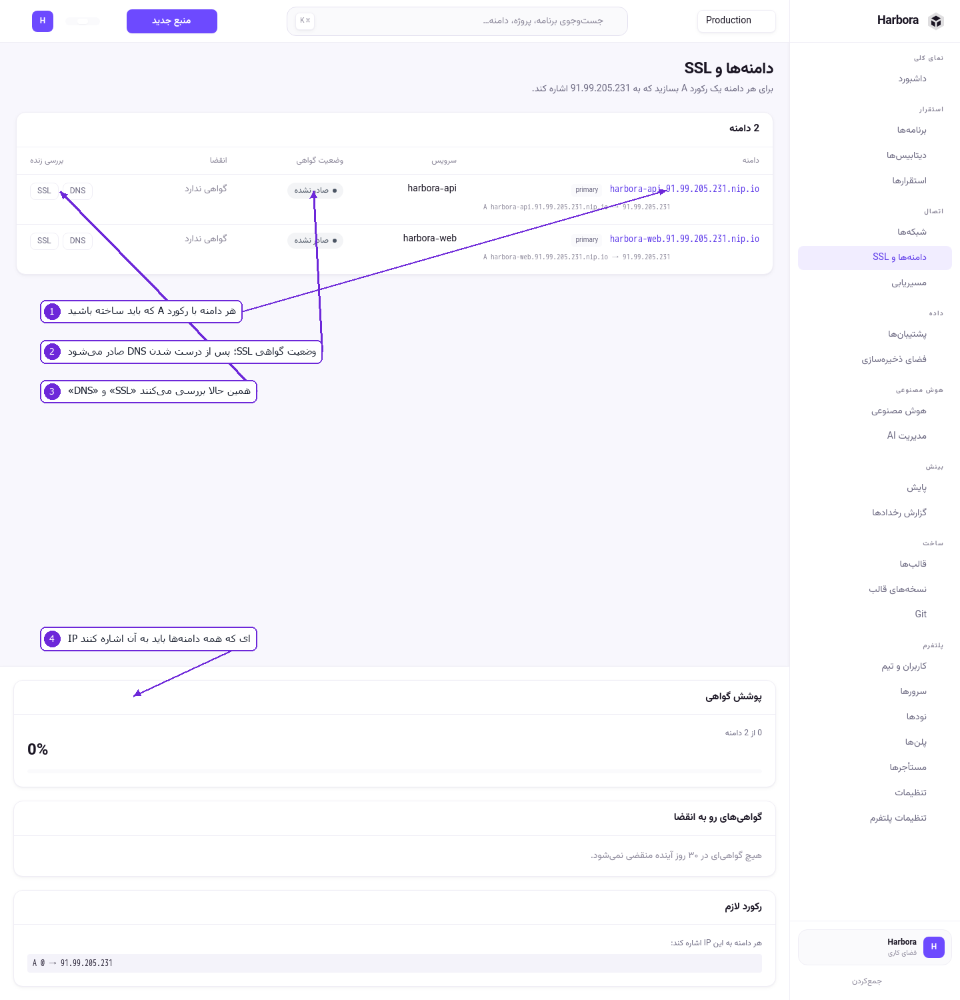

# ۶ — شبکه، دامنه و مسیریابی

## شبکه‌ها

صفحهٔ **شبکه‌ها** در [بخش ۲](02-projects-and-environments.md#شبکهها) کامل توضیح داده شده. خلاصه‌اش:
هر محیط یک شبکهٔ خصوصی دارد، و نام داخلی هر سرویس همان چیزی است که در کد می‌نویسید.

## دامنه‌ها و SSL



۱. هر دامنه با سرویسی که به آن وصل است، و رکورد A ای که باید ساخته باشید.
۲. **وضعیت گواهی** — گواهی پس از درست‌شدن DNS خودکار صادر می‌شود. «صادر نشده» یعنی هنوز نوبتش
   نرسیده یا DNS آماده نیست.
۳. **DNS** و **SSL** — همین حالا بررسی می‌کنند و می‌گویند کجای کار مانده.
۴. **رکورد لازم** — همان IP که همهٔ دامنه‌ها باید به آن اشاره کنند.

### افزودن دامنه، قدم‌به‌قدم

1. در ثبت‌کنندهٔ دامنه‌تان یک رکورد بسازید:

   ```
   A   app.example.com   →   <IP سرور>
   ```

2. در Harbora، از صفحهٔ اپ بخش **دامنه‌ها**، دامنه را اضافه کنید.
3. **DNS** را بزنید تا مطمئن شوید رکورد دیده می‌شود (انتشار DNS گاهی چند دقیقه طول می‌کشد).
4. گواهی Let's Encrypt خودکار صادر می‌شود. با **SSL** وضعیتش را ببینید.

نکته‌ها:

* ایمیل ACME در **تنظیمات** تعیین می‌شود؛ هشدار انقضای گواهی به همان می‌رود.
* دامنه‌های `nip.io` که موقع ساخت اپ خودکار می‌آیند برای آزمایش خوب‌اند و گواهی هم می‌گیرند، ولی
  برای محصول واقعی دامنهٔ خودتان را بگذارید.
* **پوشش گواهی** بالای صفحه نسبت دامنه‌های دارای گواهی به کل را می‌گوید.
* **گواهی‌های رو به انقضا** هرچه در ۳۰ روز آینده منقضی می‌شود را فهرست می‌کند. تمدید خودکار است؛
  این فهرست برای وقتی است که تمدید به مشکل خورده باشد.

## مسیریابی

بخش **مسیریابی** (فقط در پنل پیشرفته) یک طراح کشیدنی است که قوانین Traefik را می‌سازد: کدام میزبان
یا مسیر به کدام سرویس برود، با چه هدر و چه میان‌افزاری. کانفیگ خودکار ساخته و اعتبارسنجی می‌شود.

چون این صفحه تعاملی است و در تصویر ثابت چیزی نشان نمی‌دهد، تصویری برایش گذاشته نشده. کارش این است:

1. یک قانون تازه بسازید.
2. شرط را بنویسید — میزبان، مسیر، یا هر دو.
3. سرویس مقصد را از فهرست انتخاب کنید.
4. اگر لازم است میان‌افزار اضافه کنید (تغییر مسیر، هدر، احراز هویت پایه).
5. ذخیره کنید. کانفیگ ساخته و اعتبارسنجی می‌شود و بعد اعمال می‌گردد.

برای کار روزمره لازمش ندارید: دامنه‌ای که به یک اپ می‌دهید خودش مسیریابی‌اش را می‌سازد. مسیریابی
برای حالت‌های خاص است — چند سرویس زیر یک دامنه، مسیرهای `/api` و `/`، یا تغییر مسیر.

---

قدم بعدی: [بهره‌برداری](07-operations.md)
