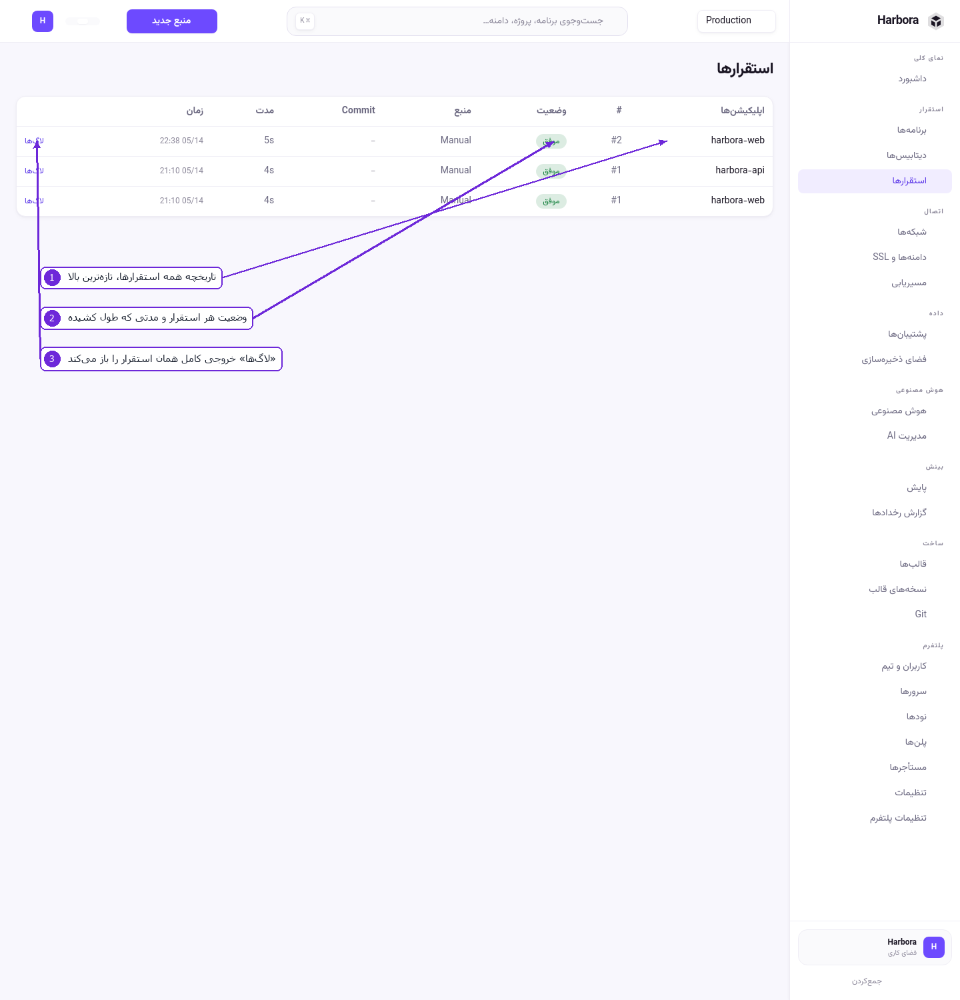
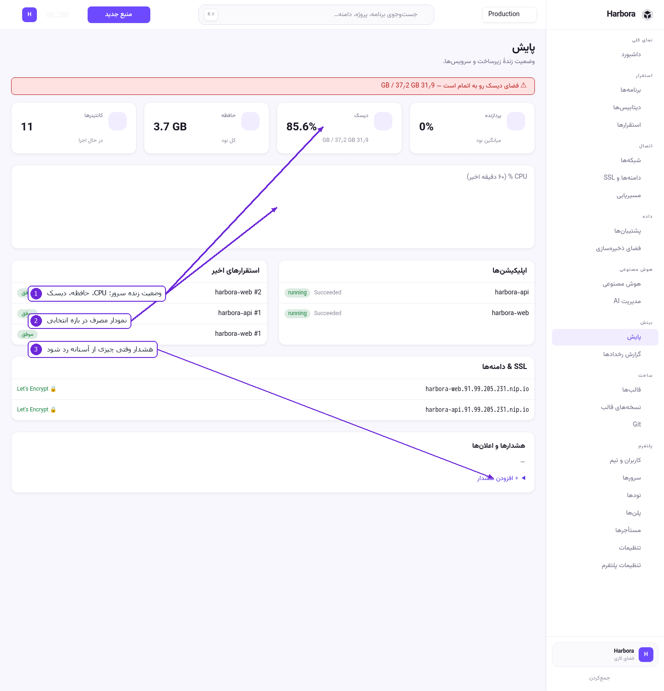
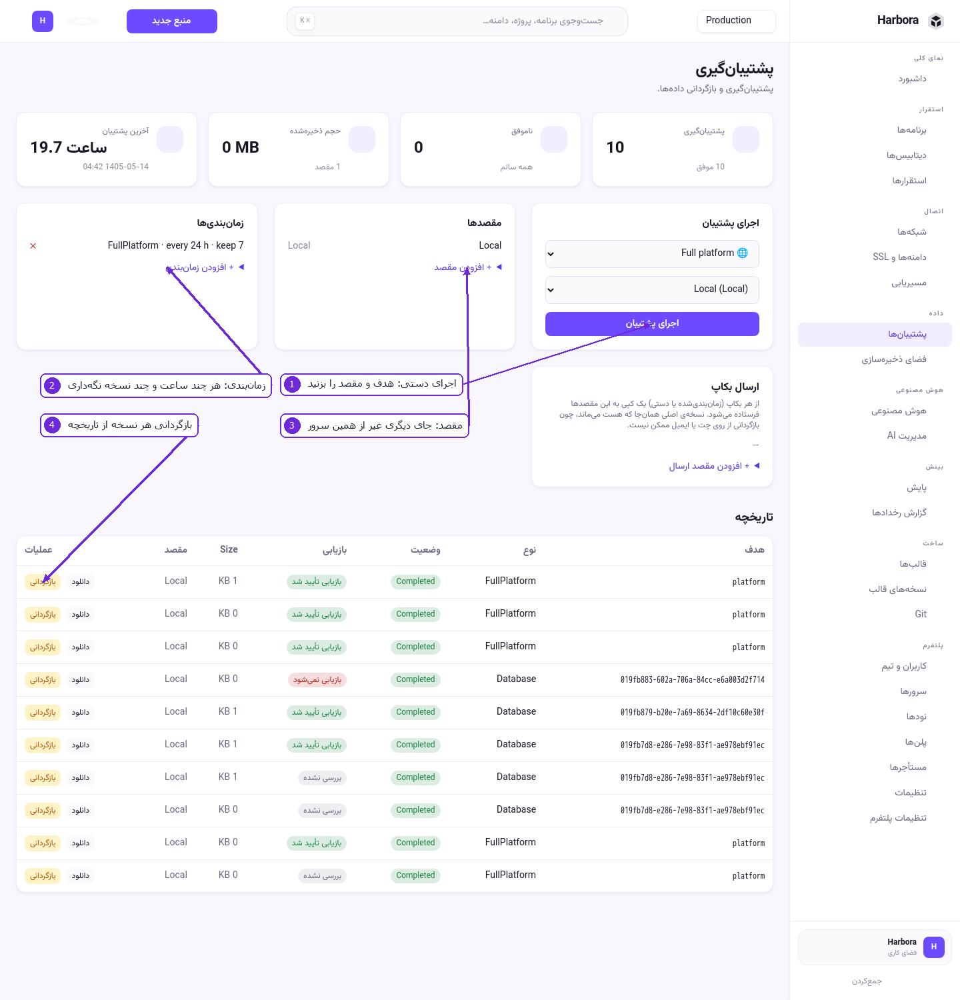
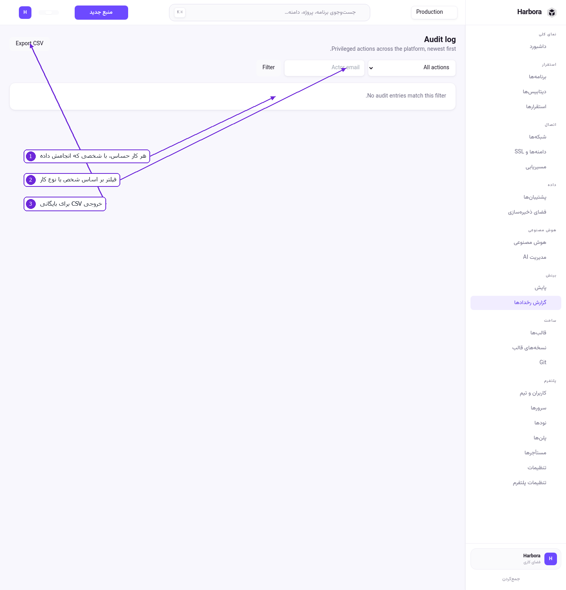

# ۷ — بهره‌برداری روزمره

## استقرارها

۱. تاریخچهٔ همهٔ استقرارهای همهٔ اپ‌ها، تازه‌ترین بالا.
۲. **وضعیت** (موفق / ناموفق / در حال اجرا)، **منبع** (Manual یا Git) و **مدت**.
۳. **لاگ‌ها** خروجی کامل همان استقرار را باز می‌کند — همان‌جا معلوم می‌شود build کجا شکسته.

اگر ستون Commit پر باشد، آن استقرار از Git آمده و می‌توانید دقیقاً بگویید کدام کد بالا رفته است.

## پایش

۱. **وضعیت زندهٔ سرور** — کانتینرهای در حال اجرا، حافظه، دیسک و CPU. نوار قرمزِ بالای صفحه وقتی
   می‌آید که دیسک رو به اتمام باشد؛ جدی‌اش بگیرید، چون با پر شدن دیسک هم build و هم پشتیبان
   شکست می‌خورد.
۲. **نمودار مصرف** در بازهٔ انتخابی. نمودار هر اپ در صفحهٔ خودش هم هست.
۳. **هشدارها و اعلان‌ها** — با **+ افزودن هشدار** یک آستانه بگذارید (مثلاً «دیسک بالای ۸۵٪») تا
   وقتی رد شد خبر بدهد.

پایین همین صفحه: آخرین استقرارها، وضعیت اپ‌ها و فهرست دامنه‌ها با وضعیت گواهی — یعنی یک نگاه به این
صفحه می‌گوید کل پلتفرم در چه حالی است.

## پشتیبان‌گیری

۱. **اجرای پشتیبان** — هدف (کل پلتفرم، یک دیتابیس، یک والیوم) و مقصد را انتخاب و اجرا کنید.
۲. **زمان‌بندی‌ها** — «هر ۲۴ ساعت، ۷ نسخه نگه‌دار». نسخهٔ قدیمی‌تر خودش پاک می‌شود.
۳. **مقصدها** — `Local` یعنی همین سرور. برای اینکه پشتیبان واقعاً به درد بخورد، یک مقصد بیرونی هم
   اضافه کنید؛ پشتیبانی که روی همان سروری است که ممکن است از دست برود، پشتیبان نیست.
۴. **تاریخچه** — هر نسخه با **دانلود** و **بازگردانی**. ستون «بازیابی» می‌گوید آن نسخه اصلاً قابل
   بازگردانی هست یا نه.

### قدم‌به‌قدم: پشتیبان شبانه

1. **پشتیبان‌ها** › **+ افزودن مقصد** — جایی بیرون از این سرور.
2. **+ افزودن زمان‌بندی** — هدف را «Full platform»، فاصله را ۲۴ ساعت و تعداد نگه‌داری را ۷ بگذارید.
3. یک بار **اجرای پشتیبان** را دستی بزنید تا مطمئن شوید مقصد کار می‌کند.
4. در تاریخچه، ستون «بازیابی» همان نسخه را ببینید.

**ارسال بکاپ** یک کپی از هر پشتیبان را به مقصدها می‌فرستد؛ نسخهٔ اصلی سر جایش می‌ماند.

> بازگردانی از روی چت یا ایمیل ممکن نیست. تنها راه بازگردانی، همین تاریخچه است.

## گزارش رخدادها

۱. هر کار حساس، با شخصی که انجامش داده و زمانش: ساخت و حذف، تغییر دسترسی، نوشتن در فایل‌های یک
   والیوم، چرخاندن سکرت.
۲. **فیلتر** بر اساس ایمیل شخص یا نوع کار.
۳. **Export CSV** برای بایگانی بیرون از پلتفرم.

## مرکز پشتیبان و هشدارها (ماژول اختیاری)

دو ماژول تا وقتی روشن نشده‌اند صفحه‌ای ندارند و آدرسشان ۴۰۴ می‌دهد — عمداً، تا چیزی که کار نمی‌کند
در منو دیده نشود:

| ماژول | کلید | چه اضافه می‌کند |
|-------|------|------------------|
| مرکز پشتیبان | `Features:Backup = true` | مخزن، سیاست، snapshot و restore جداگانه |
| همگام‌سازی فایل | `Features:Sync = true` | همگام‌سازی مسیرها با موتور Syncthing |

وضعیتشان در **تنظیمات پلتفرم** › **ماژول‌های اختیاری** دیده می‌شود.

---

قدم بعدی: [هوش مصنوعی](08-ai.md)
