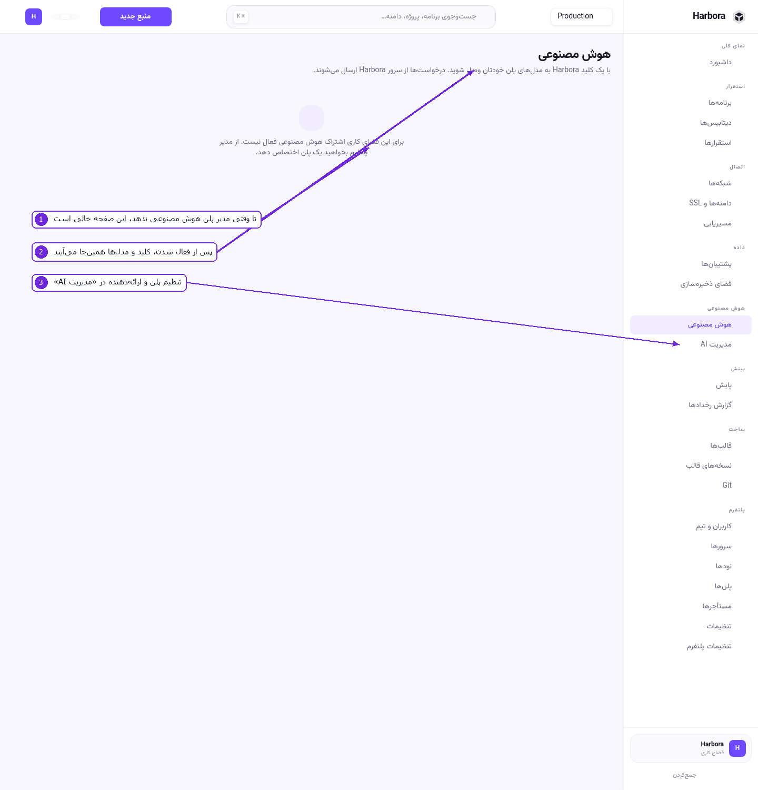
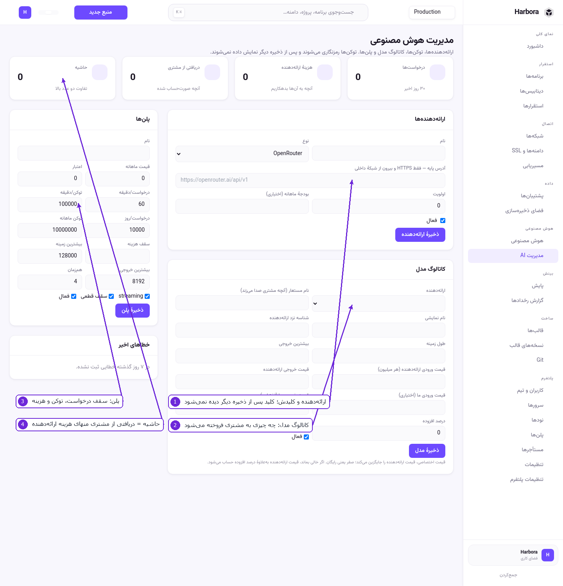

# ۸ — هوش مصنوعی

Harbora یک دروازهٔ AI دارد: مدل‌ها را از یک یا چند ارائه‌دهنده می‌گیرد، پشت یک کلید و یک API سازگار
با OpenAI به فضاهای کاری می‌فروشد، و مصرف را می‌شمارد.

دو صفحه دارد و ترتیبشان مهم است: اول **مدیریت AI** (کار مدیر)، بعد **هوش مصنوعی** (کار کاربر).

## صفحهٔ کاربر



۱. تا وقتی مدیر به این فضای کاری پلن هوش مصنوعی نداده باشد، صفحه همین را می‌گوید و کار دیگری
   نمی‌کند. این حالت درست است، نه خطا.
۲. پس از فعال‌شدن، کلید و فهرست مدل‌های همان پلن اینجا می‌آید.
۳. تنظیمش در **مدیریت AI** است.

پس از فعال‌شدن، درخواست‌ها از سرور Harbora ارسال می‌شوند — یعنی کلید ارائه‌دهنده هیچ‌وقت به دست
کاربر نمی‌رسد و مصرف قابل شمردن است. مسیرش سازگار با OpenAI است:

```bash
curl https://panel.example.com/v1/chat/completions \
  -H "Authorization: Bearer <کلید فضای کاری>" \
  -H "Content-Type: application/json" \
  -d '{"model":"<نام مستعار مدل>","messages":[{"role":"user","content":"سلام"}]}'
```

مسیرهای موجود: `GET /v1/models`، `POST /v1/chat/completions`، `POST /v1/responses`،
`POST /v1/embeddings`.

## مدیریت AI



۱. **ارائه‌دهندگان** — نوع (OpenRouter، OpenAI، سازگار با OpenAI، مدل محلی)، آدرس پایه و کلید.
   کلید رمزنگاری‌شده ذخیره می‌شود و **پس از ذخیره دیگر نمایش داده نمی‌شود**. اولویت و بودجهٔ ماهانه
   هم همین‌جا تعیین می‌شود.
۲. **کاتالوگ مدل** — کدام مدل از کدام ارائه‌دهنده، با چه **نام مستعاری** به مشتری فروخته می‌شود.
   قیمت ورودی/خروجی ارائه‌دهنده و قیمت خودتان جدا نوشته می‌شود، و توانایی‌ها (embeddings، vision،
   tools، stream) تیک می‌خورد.
۳. **پلن‌ها** — سقف درخواست در دقیقه و در روز، سقف توکن در دقیقه و در ماه، بیشترین طول زمینه،
   بیشترین خروجی، تعداد همزمان، و سقف هزینه. «سقف قطعی» یعنی با رسیدن به سقف، درخواست رد شود.
۴. **حاشیه** — دریافتی از مشتری منهای هزینهٔ ارائه‌دهنده، در ۳۰ روز گذشته. کنارش تعداد درخواست‌ها و
   خطاهای اخیر است.

### قدم‌به‌قدم: راه‌اندازی AI

1. **مدیریت AI** › بخش **ارائه‌دهندگان**: نام، نوع، آدرس پایه و کلید API را بگذارید و
   **ذخیرهٔ ارائه‌دهنده** را بزنید.
2. بخش **کاتالوگ مدل**: ارائه‌دهنده را انتخاب کنید، شناسهٔ مدل نزد ارائه‌دهنده و نام مستعار را
   بنویسید، قیمت‌ها و توانایی‌ها را پر کنید و ذخیره کنید.
3. بخش **پلن‌ها**: یک پلن با سقف‌هایش بسازید.
4. پلن را به فضای کاری بدهید (از **مستأجرها** یا از همین صفحه).
5. حالا صفحهٔ **هوش مصنوعی** برای آن فضای کاری کلید و مدل‌ها را نشان می‌دهد.

> آدرس پایهٔ ارائه‌دهنده باید HTTPS باشد، مگر اینکه داخل شبکهٔ داخلی خودتان باشد (مثلاً یک مدل محلی
> روی `http://localhost:11434`). برای مدل محلیِ روی همان ماشین، کلید لازم نیست.

## دستیار داخل پنل

جدا از دروازه، یک **دستیار** هم هست که خطای استقرار را توضیح می‌دهد. در **تنظیمات** روشنش کنید،
ارائه‌دهنده و مدل و کلید بدهید و **تست اتصال** را بزنید. لاگ پیش از ارسال پاک‌سازی می‌شود و کاربر
دقیقاً همان متنی را که فرستاده می‌شود پیش از ارسال می‌بیند.

---

قدم بعدی: [مدیریت پلتفرم](09-administration.md)
