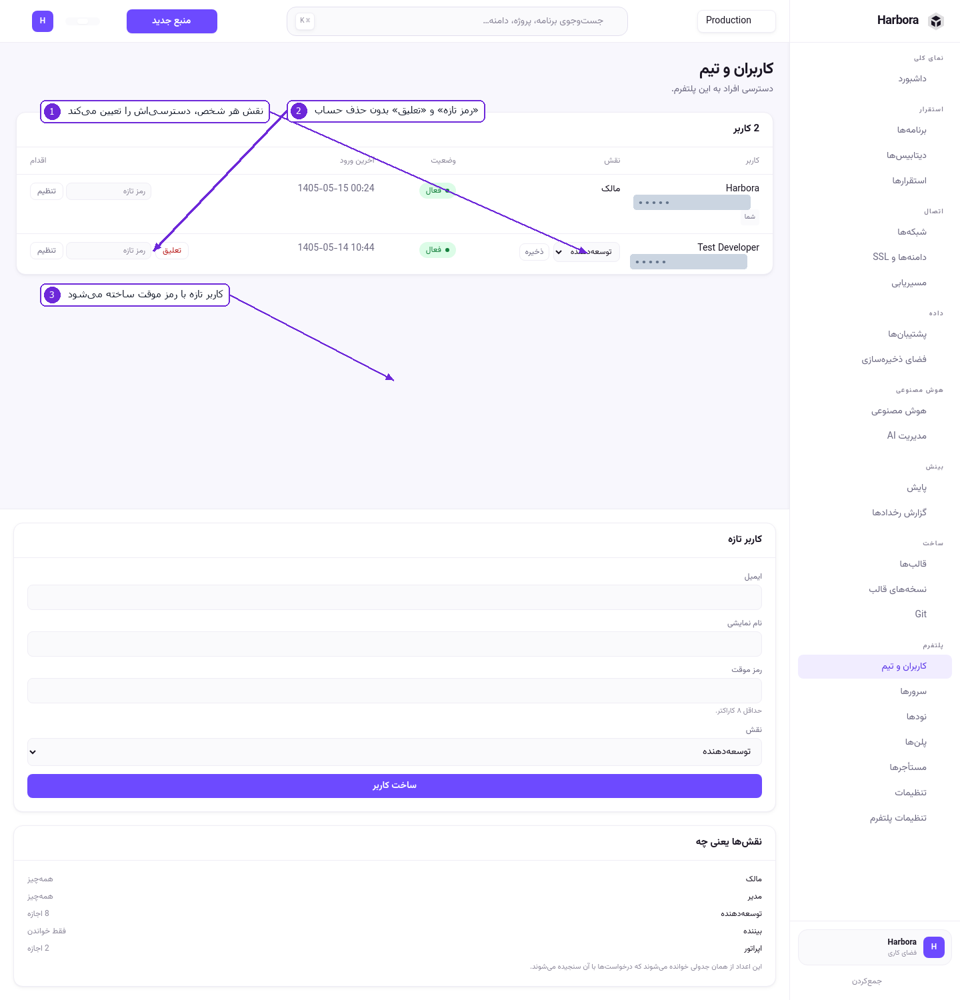
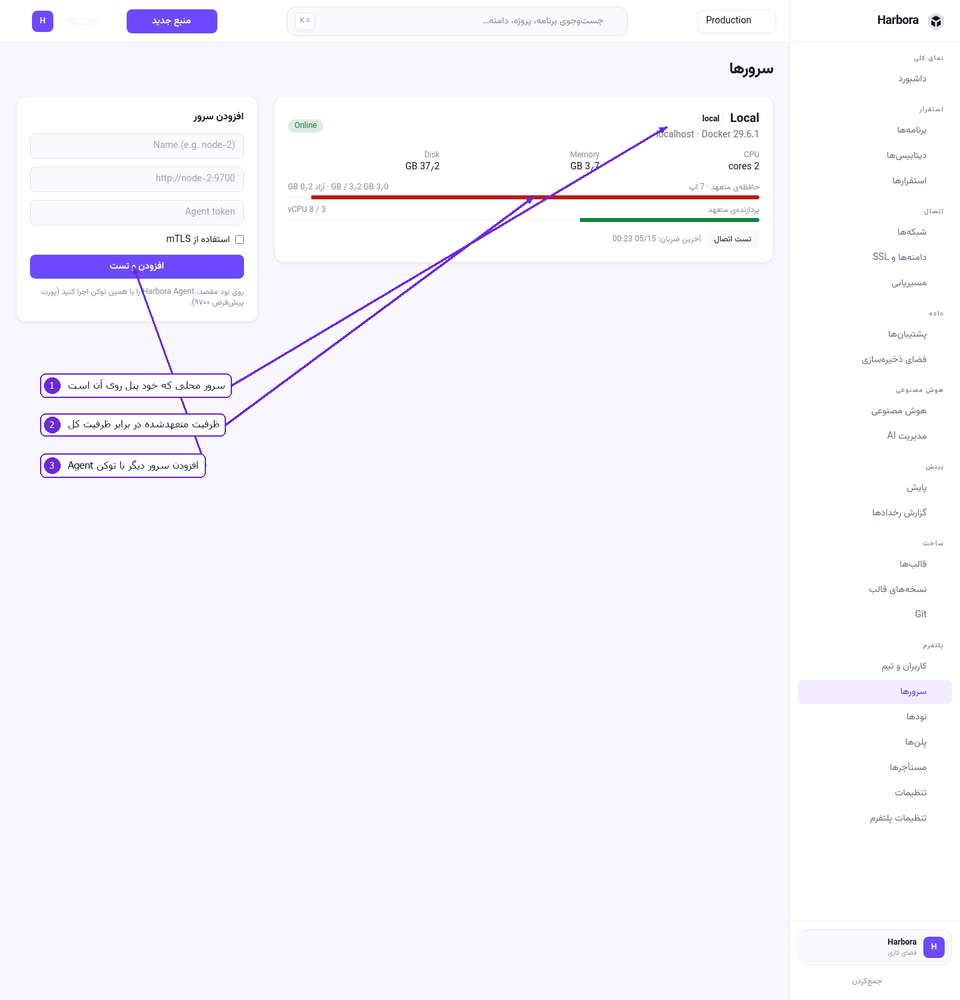
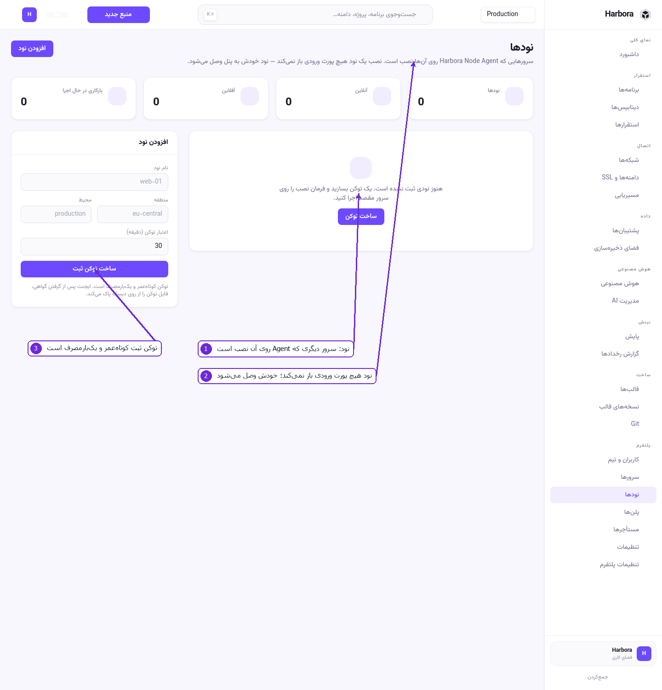
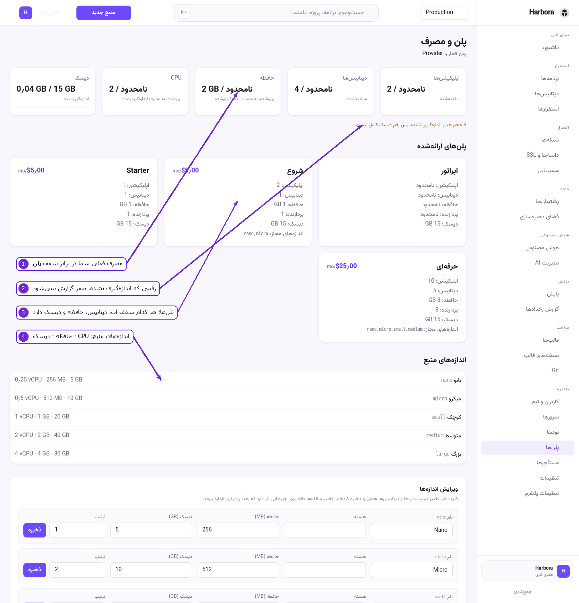
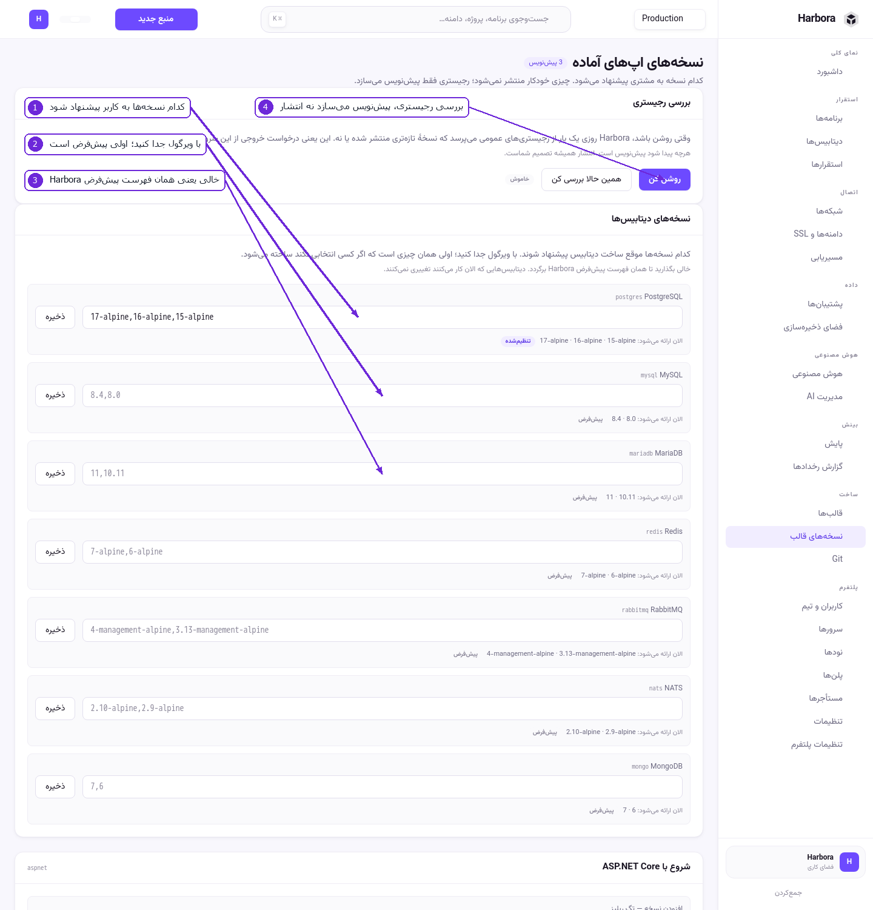
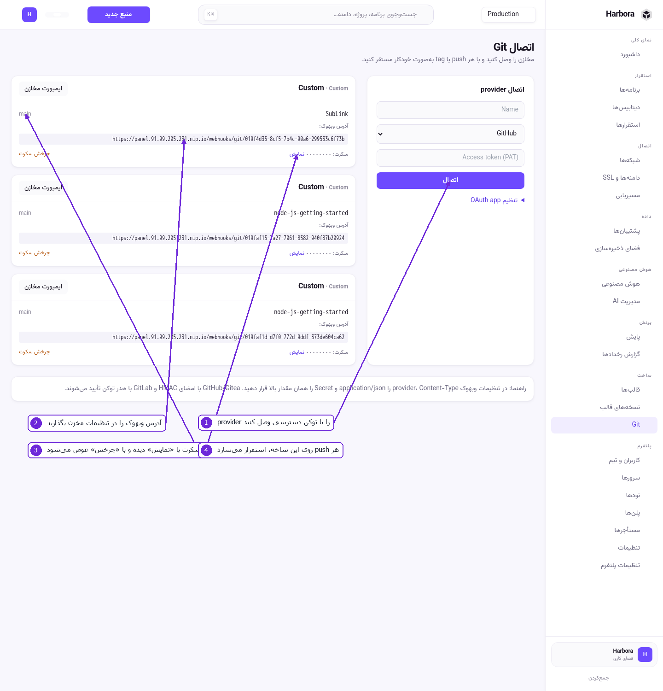
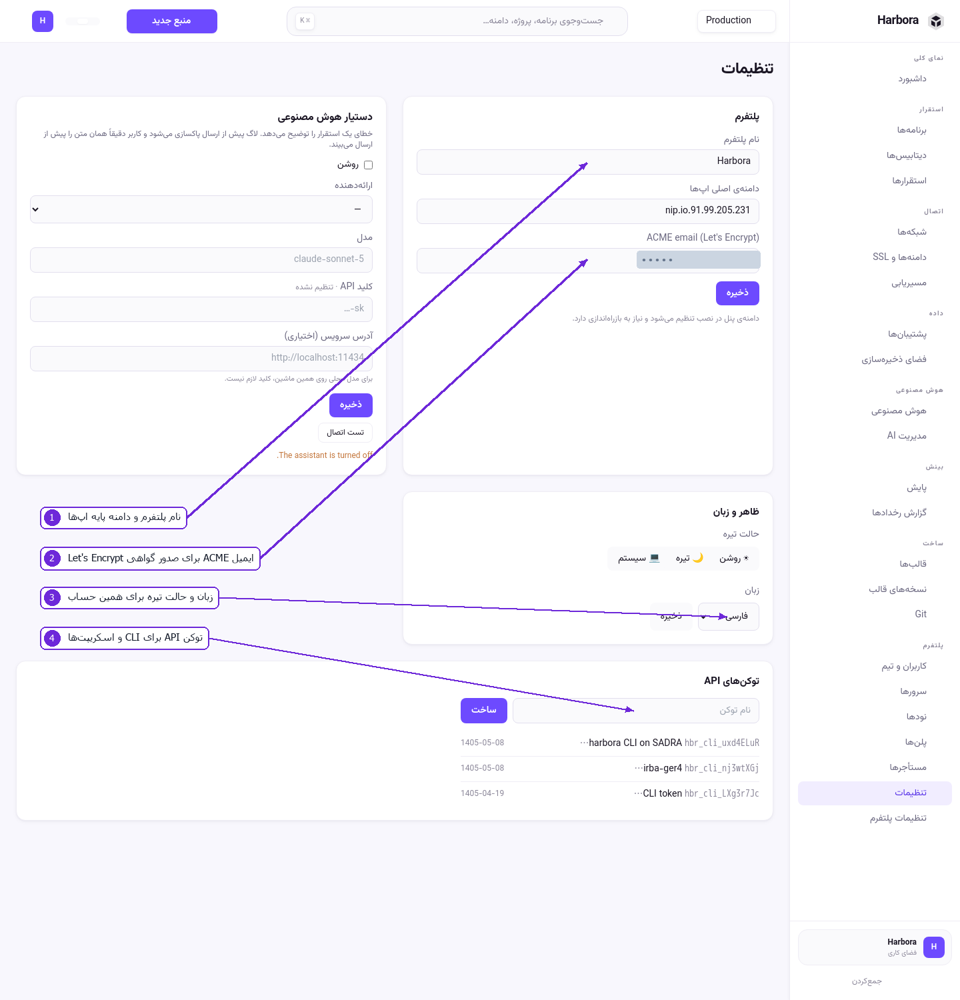
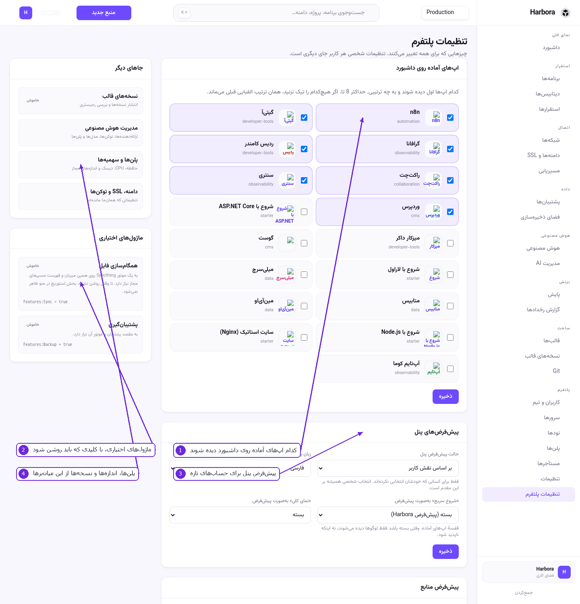

# ۹ — مدیریت پلتفرم

این بخش‌ها فقط برای کسی است که پلتفرم را می‌گرداند.

## کاربران و تیم

۱. **نقش** هر شخص دسترسی‌اش را تعیین می‌کند:

   | نقش | دسترسی |
   |-----|---------|
   | مالک | همه‌چیز. در نصب اولیه ساخته می‌شود |
   | مدیر | همه‌چیز، جز انتقال مالکیت |
   | توسعه‌دهنده | ساخت، استقرار و مدیریت اپ، دیتابیس، مسیر و Git |
   | اپراتور | فقط کار روزمره: توقف، راه‌اندازی مجدد، اجرای پشتیبان. ساخت و حذف و استقرار نه |
   | بیننده | فقط خواندن |

۲. **رمز تازه** و **تعلیق** — بدون حذف حساب. تعلیق ورود را می‌بندد ولی چیزی را پاک نمی‌کند.
۳. **کاربر تازه** با یک رمز موقت (حداقل ۸ کاراکتر) ساخته می‌شود؛ خودش بعداً عوضش می‌کند.

## سرورها

۱. **Local** همان ماشینی است که پنل روی آن نصب است.
۲. **ظرفیت متعهدشده** در برابر ظرفیت کل — حافظه و CPU ای که به سرویس‌ها قول داده شده. نوار قرمز یعنی
   جای زیادی نمانده و ساخت بعدی ممکن است رد شود.
۳. **افزودن سرور** با آدرس و توکن Agent. **تست اتصال** پیش از ذخیره امتحان می‌کند.

## نودها

۱. **نود** سروری است که Harbora Node Agent روی آن نصب است — از جمله یک ماشین خانگی پشت NAT.
۲. نصب نود **هیچ پورت ورودی باز نمی‌کند**؛ خود نود به پنل وصل می‌شود. برای همین اینترنت خانگی هم
   جواب می‌دهد.
۳. **توکن ثبت** کوتاه‌عمر و یک‌بارمصرف است. پس از گرفتن گواهی، Agent فایل توکن را از دیسک پاک
   می‌کند.

### افزودن نود

1. **نودها** › **ساخت توکن ثبت**: نام، منطقه، محیط و اعتبار توکن (پیش‌فرض ۳۰ دقیقه).
2. دستور نصب را روی سرور مقصد اجرا کنید.
3. نود خودش وصل می‌شود و در فهرست «آنلاین» می‌شود.

محدودیت‌های نود:

* **build از Git ندارد.** ایمیج آماده و قالب کار می‌کند.
* آمار هر کانتینر فقط اگر Agent آن را اعلام کرده باشد می‌آید؛ اگر نه، پنل می‌نویسد این نود آمار
  نمی‌دهد — نمودار خالی نشان نمی‌دهد.
* اگر پنل نتواند به نود وصل شود (NAT)، ترافیک از خود پنل و از تونلی که نود باز کرده رد می‌شود.

## پلن‌ها و سهمیه‌ها

۱. **مصرف فعلی** فضای کاری در برابر سقف پلنش.
۲. رقمی که هنوز اندازه‌گیری نشده، صفر گزارش نمی‌شود؛ زیر کارت‌ها می‌نویسد چند مورد سنجیده نشده.
۳. **پلن‌های ارائه‌شده** — هر پلن سقف اپ، دیتابیس، حافظه، CPU و دیسک دارد، و می‌تواند اندازه‌های
   مجاز را محدود کند (`nano,micro`).
۴. **اندازه‌های منبع** — هر تیر با `CPU · حافظه · دیسک`. همین برچسب در همهٔ انتخابگرهای پلتفرم
   دیده می‌شود.

مدیر می‌تواند همین‌جا پلن و اندازه بسازد یا ویرایش کند؛ هر فیلد برچسب خودش را دارد.

## نسخه‌های قالب

۱. برای هر موتور دیتابیس، **کدام نسخه‌ها** به کاربر پیشنهاد شود.
۲. با ویرگول جدا کنید. **اولی پیش‌فرض است** — همان چیزی که اگر کسی انتخابی نکند ساخته می‌شود.
۳. خالی بگذارید تا همان فهرست پیش‌فرض Harbora برگردد. دیتابیس‌هایی که همین حالا کار می‌کنند با این
   تغییر دست نمی‌خورند.
۴. **بررسی رجیستری** می‌پرسد نسخهٔ تازه‌تری منتشر شده یا نه، و اگر پیدا کند فقط **پیش‌نویس**
   می‌سازد. انتشار همیشه تصمیم شماست، و این بررسی پیش‌فرض خاموش است چون یک درخواست خروجی به شخص
   ثالث است.

نسخهٔ اپ‌های آماده هم در همین صفحه، پایین‌تر، اضافه و منتشر می‌شود.

## Git

۱. **اتصال provider** — GitHub، GitLab، Gitea یا Custom، با توکن دسترسی. با **ایمپورت مخازن**
   فهرست مخزن‌ها می‌آید.
۲. **آدرس وبهوک** — این را در تنظیمات وبهوکِ مخزن بگذارید، با `Content-Type: application/json`.
۳. **سکرت وبهوک** — با **نمایش** دیده می‌شود (پنهان است تا صفحه قابل اشتراک‌گذاری بماند)؛ همان
   مقدار را در فیلد Secret مخزن بگذارید. با **چرخش سکرت** عوض می‌شود.
۴. از آن به بعد هر `push` روی شاخهٔ تعیین‌شده یک استقرار می‌سازد.

GitHub و Gitea با امضای HMAC تأیید می‌شوند و GitLab با هدر توکن.

## مستأجرها

هر مستأجر یک فضای کاری است، با پلن، مصرف و اعضای خودش. از این صفحه پلن هر فضای کاری تعیین می‌شود و
مصرف ماهانه‌اش (ساعت-هسته و گیگابایت-ساعت) دیده می‌شود.

## تنظیمات

۱. **نام پلتفرم** و **دامنهٔ اصلی اپ‌ها** — دامنه‌ای که زیردامنه‌های خودکار از آن ساخته می‌شوند.
   عوض‌کردنش نیاز به راه‌اندازی مجدد دارد.
۲. **ایمیل ACME** — برای صدور و هشدار گواهی Let's Encrypt.
۳. **ظاهر و زبان** — فارسی/English، روشن/تیره/سیستم. مخصوص همین حساب.
۴. **توکن‌های API** — برای CLI و اسکریپت. توکن فقط یک بار نشان داده می‌شود.

بخش **دستیار هوش مصنوعی** هم در همین صفحه است (نگاه کنید به [بخش ۸](08-ai.md)).

## تنظیمات پلتفرم

۱. **اپ‌های آمادهٔ روی داشبورد** — کدام‌ها و به چه ترتیبی دیده شوند، حداکثر ۸ تا. اگر هیچ‌کدام تیک
   نخورد، همان ترتیب الفبایی می‌ماند.
۲. **ماژول‌های اختیاری** — همگام‌سازی فایل و پشتیبان‌گیری، با کلیدی که باید در تنظیمات روشن شود.
۳. **پیش‌فرض‌های پنل** — نمای پیش‌فرض حساب‌های تازه (ساده یا پیشرفته)، و پیش‌فرض بلوک‌های داشبورد.
   انتخاب شخصی هر کاربر همیشه بر این می‌چربد.
۴. **جاهای دیگر** — میان‌بر به نسخه‌های قالب، مدیریت AI، پلن‌ها و دامنه/توکن‌ها.

---

برگشت به [فهرست](README.md)
